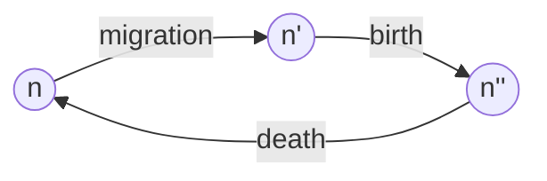

<link rel="stylesheet" href="https://unpkg.com/thebe@latest/lib/thebe.css">

# Tutorial 1: Building recursion equations

	Run notes interactively?
	

	

Let's get some more practice building recursion equations.

## Review

In Lecture 1 we asked, how does immigration affect population size?

We then built a model with a single variable, $n(t)$, denoting population size at time $t$. 

In discrete time the parameters were the average number of immigrants per time step ($M$), the average number of offspring per individual per time step ($B$), and the fraction of individuals that die each time step ($D$). 

Assuming migration, then birth, then death each time step, we drew the following **life-cycle diagram**:

We then built an equation for the population size in the next generation, $n(t+1)$, based on the life-cycle diagram above, by constructing an equation for each event 

$$n' = n(t) + M$$

$$n'' = n' + Bn'$$

$$n(t+1) = n'' - Dn''$$

We then substituted $n''$ and then $n'$ into the equation for $n(t+1)$ to write $n(t+1)$ in terms of $n(t)$

$$
\begin{aligned}
n(t+1) &= n'' − Dn'' \\
&= (n' + Bn') − D(n' + Bn') \\
&= n'(1 + B − D − DB) \\
&= (n(t) + M)(1 + B − D − DB) \\
\end{aligned}
$$

This **recursion equation** correctly takes into account the order of the life cycle (migration, birth, death) and the point at which the census is taken (immediately after death).

## Problem

Show that the six different life-cycle orders give four distinct recursion equations.
