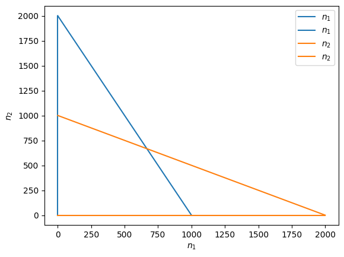

<link rel="stylesheet" href="https://unpkg.com/thebe@latest/lib/thebe.css">

# Tutorial 7: Lotka-Volterra competition

	Run notes interactively?
	

	

## Model

As we saw in Tutorial 4, competition between two species can be modelled with the two-species Lotka-Volterra model, which is an extension of logistic growth to two species,

$$
\frac{\mathrm{d}n_1}{\mathrm{d}t} = n_1 r_1 \left(1 - \frac{n_1 + \alpha_{12}n_2}{K_1}\right)
$$

$$
\frac{\mathrm{d}n_2}{\mathrm{d}t} = n_2 r_2 \left(1 - \frac{n_2 + \alpha_{21}n_1}{K_2}\right).
$$

Here $n_i$ is the number of individuals of species $i$, $r_i$ is the intrinsic growth rate of species $i$, $K_i$ is the carrying capacity of species $i$, and $\alpha_{ij}$ is the competitive effect an individual of species $j$ has on an individual of species $i$. Assume all parameters are positive.

In Tutorial 4 we solved for the nullclines, which are plotted below.

<pre data-executable="true" data-language="python">
import matplotlib.pyplot as plt
from sympy import *
import numpy as np

# variables
n1, n2 = symbols('n1, n2')

# parameter values
r1, r2 = 0.5, 0.5
k1, k2 = 1000, 1000
a12, a21 = 0.5, 0.5

# differential equations
dn1 = r1 * n1 * (1 - (n1 + a12 * n2) / k1)
dn2 = r2 * n2 * (1 - (n2 + a21 * n1) / k2)

# find nullclines
nullcline_1 = solve(Eq(dn1, 0),n1)
nullcline_2 = solve(Eq(dn2, 0),n2)

fig, ax = plt.subplots()

nmax = 2000
xrange, yrange = np.linspace(0, nmax, 100), np.linspace(0, nmax, 100)
for cline in nullcline_1:
    ax.plot([cline.subs(n2,i) for i in yrange], yrange, color=plt.cm.tab10(0), label='$n_1$')
for cline in nullcline_2:
    ax.plot(xrange, [cline.subs(n1,i) for i in xrange], color=plt.cm.tab10(1), label='$n_2$')

plt.xlabel('$n_1$')
plt.ylabel('$n_2$')
plt.legend()
plt.show()
</pre>

    

    

## Problem

Solve for the four equilibria. When are they biologically valid?

Derive the Jacobian.

Determine the conditions for local stability for each of the three equilibria where at least one species is extinct.

<pre data-executable="true" data-language="python">

</pre>
