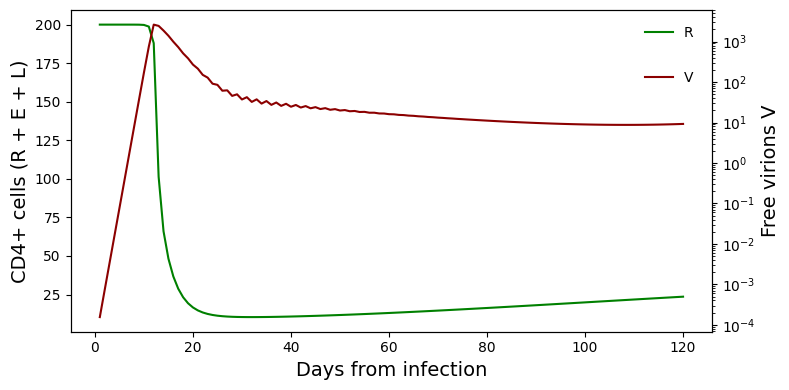
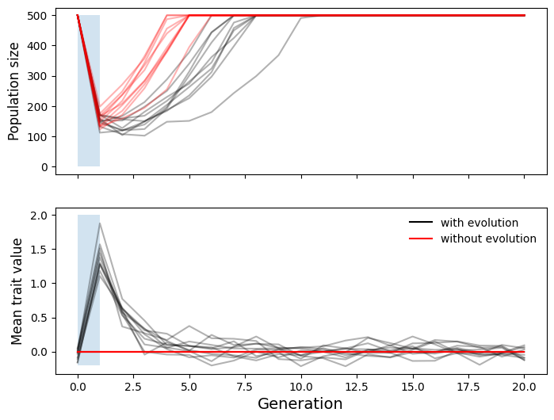

# Lecture 1: Introduction

	Run notes interactively?
	

	

## Lecture overview

1. [Why use mathematical models in ecology and evolution?](#section1)
2. [Syllabus](#section2)

## 1. Why use mathematical models in ecology and evolution?

Mathematics permeates ecology and evolution, from simple back-of-the-envelope calculations to the development of sophisticated mathematical models. This is because mathematics is a unique tool that can take what we already know (or assume to be true) and rigorously lead us to the logical conclusions.

To see this (while also introducing you to the kind of models I work with), let's look at a few examples.

### Example 1: HIV

See sections 1.2-1.4 of the text for more info.

Human immunodeficiency virus (HIV) is, as the name suggests, a virus that infects humans and causes acquired immunodeficiency syndrome (AIDS). This is a terrible diesase that has caused over 20 million deaths worldwide. It is transmitted via bodily fluids. Once inside the body HIV particles (virions) attach to a protein called CD4 on the cell membrane of helper T cells (part of our immune system) and others. Once attached, the virus inserts its RNA into the host cell, which is reverse transcribed into DNA and becomes part of the host genome. The host cell can remain in the 'latently infected' state for some time. When the viral DNA is eventually transcribed by the host cell, starting an 'active infection', hundreds of new virions are produced, often killing the host cell. These new virions then go on to infect other CD4+ cells. A large decline in the number of helper T cells is what causes AIDS. This is because helper T cells bind to viruses and secrete chemical signals to stimulate the immune system. So without helper T cells the immune system is very comprimised.

Based on this, once infected with HIV (and without treatment) we expect the number of virions to rapidly increase and the number of helper T cells to decline. This is generally what is observed. However, the number of virions then tends to steeply decline. Why might this be?

Here are two hypotheses:

1. the immune system recognizes HIV and suppresses it
2. the decline in helper T cells prevents HIV from replicating

To decide whether the second hypothesis is valid [Phillips (1996)](https://www.science.org/doi/abs/10.1126/science.271.5248.497) built a mathematical model describing the rate of change in the number of CD4+ cells and free virions. 

See the note below for the details of the model if you are interested (but don't worry if you don't understand all this yet!).

??? note "Details of the Philips (1996) model"

    See Box 2.4 in the text for more details.

    Philips built a dynamical model of the infection process using 4 differential equations:

    $\frac{dR}{dt} = \Gamma \tau - \mu R - \beta V R$

    $\frac{dL}{dt} = p \beta V R - \mu L - \alpha L$

    $\frac{dE}{dt} = (1 - p) \beta V R + \alpha L - \delta E$

    $\frac{dV}{dt} = \pi E - \sigma V$

    These equations describe the rate of change in the number of susceptible CD4+ cells (R), latently infected cells (L), actively infected cells (E), and free virions (V). These are the 4 "variables" of the model, as their values change over time. The remainder of the symbols represent "parameters", whose values do not change (they are constants). The meaning of the parameters and the values used by Phillips (1996) are shown in the table below.

    | Symbol | Description | Value (units/day) |
    | ------ | ----------- | ----------------- |
    | $\Gamma$ | Rate that CD4+ cells are produced | 1.36 |
    | $\tau$ | Proportion of CD4+ cells that are susceptible to attack | 0.2 |
    | $\mu$ | HIV-independent death rate of susceptible CD4+ cells | 1.36 x 10^-3 |
    | $\beta$ | Rate of CD4+ cell infection per HIV virion | 0.00027 | 
    | $p$ | Proportion of newly infected cells becoming latently infected | 0.1 | 
    | $\alpha$ | Activation rate of latently infected cells | 3.6 x 10^-2 |
    | $\delta$ | Death rate of actively infected cells | 0.33 |
    | $\pi$ | Rate of production of virions by actively infected cells | 100 |
    | $\sigma$ | Removal rate of cell-free virus | 2 |
    
    Given these parameter descriptions, can you "read" the differential equations above? For example, what does $\Gamma \tau$ represent, biologically?

    Using these equations and parameter values Philips (1996) asked how the number of CD4+ cells (R + L + E) and free virions (V) changed over time following infection. 

To see how Philips' model behaves, activate the kernel at the top of the page and run the code below

<pre data-executable="true" data-language="python">
import numpy as np
import matplotlib.pyplot as plt

# Build a function to iterate through the model (see note above for description of equations)
def philips_model(R=200, L=0, E=0, V=4e-5, days=120, steps=120):
    #choose parameter values
    gamma, mu, tau, beta, p, alpha, sigma, delta, pi = [1.36, 1.36e-3, 0.2, 0.00027, 0.1, 3.6e-2, 2, 0.33, 100] 
    record = []
    for t in np.linspace(0, days, steps):        
        dRdt = gamma * tau - mu * R - beta * V * R
        R += dRdt
        dLdt = p * beta * V * R - mu * L - alpha * L
        L += dLdt
        dEdt = (1-p) * beta * V * R + alpha * L - delta * E
        E += dEdt
        dVdt = pi * E - sigma * V
        V += dVdt
        record += ([[R + L + E, V]])
    return np.array(record)

# Interpolate through differentials and record population sizes
steps = 120
days = 120
uninfected_lymphocytes, free_virions = philips_model(days=days, steps=steps).T
number_of_days = np.linspace(1, days, steps)

# Initialize plot
fig, left_ax = plt.subplots()
right_ax = left_ax.twinx()
fig.set_size_inches(8,4)

# Plot data on left axis
left_ax.plot(number_of_days, uninfected_lymphocytes, color='green', label='R');
left_ax.set_ylabel('CD4+ cells (R + E + L)', fontsize=14)
left_ax.legend(frameon=False, bbox_to_anchor=(0.99, 0.99))
left_ax.set_xlabel('Days from infection', fontsize=14)

# Plot data on right axis
right_ax.plot(number_of_days, free_virions, color='darkred', label='V');
right_ax.set_ylabel('Free virions V', fontsize=14)
right_ax.legend(frameon=False, bbox_to_anchor=(0.99, 0.85))

# Format plot and show it
plt.yscale('log')
fig.tight_layout()
plt.show()
</pre>

Compare to Figure 1.3 and Figure 1.4 in the text. We see the initial increase in virions (red) and delcine in CD4+ cells (green), followed by a decline virions (note the log scale on the right axis -- this is a big decline, from over 1000 to about 10). Because this model does not include an immune response against the virions but still exhibits the decline in virions, we conclude that the second hypothesis is valid, that it is theoretically plausible that the decline in virions is due to a lack of CD4+ cells to infect. A few years later this hypothesis was empirically tested and validated -- a nice example of theory guiding science.

Feel free to play around with the code above, changing parameter values or even the structure of the model. Do the dynamics change as you expected?

### Example 2: Extreme Events

A second example is a model that I helped Dr. Kelsey Lyberger (then a PhD student at UC Davis with Sebastian Schreiber) with in [Lyberger et al 2021](https://www.biorxiv.org/content/10.1101/2020.04.02.014951v2).

{ width=50% }

Kelsey Lyberger, doing <i>Daphnia</i> fieldwork I suppose.

Kelsey was interested in how populations respond to extreme climatic events, like hurricanes. It has long been clear that such events can impact the size of a population, e.g., by causing extra mortality, and may in fact put populations at risk of extinction. More recently it has become apparent that extreme events can also impose strong natural selection, and that populations can quickly adapt to the new environment. Some examples include:

- [Ice-storms select on sparrow body size](https://www.jstor.org/stable/2406980)
- [Hurricanes select on lizard limbs and toe pads](https://www.pnas.org/doi/10.1073/pnas.2000801117)
- [Droughts select on Darwin finch beaks](https://www.science.org/doi/10.1126/science.aad8786)
- [Droughts select on flowering time in *Brassica*](https://nph.onlinelibrary.wiley.com/doi/10.1111/j.1469-8137.2010.03603.x)

Now, how should such rapid adaptive evolution impact population size? This is the question Kelsey set out to answer with a mathematical model.

!!! todo "To do: give details of Kelsey's model"

Below is a stochastic simulation much like that used by Kelsey. With an activated kernel, run the code below to create a plot very similar to Figure 1 in Lyberger et al. (this may take a minute).

<pre data-executable="true" data-language="python">
import numpy as np
import matplotlib.pyplot as plt

def lyberger_model(Vg=0.75, Ve=0, event_duration=1, seed=0, other_parameters=[120, 500, 1, 2, 100, 0, 2.5]):
    # Unpack parameters
    generations, K, w, lmbda, event_time, initial_theta_t, dtheta_t = other_parameters
    
    # Initialize population
    members = np.random.normal(initial_theta_t, 0, K)
    
    # Run simulations
    np.random.seed(seed)
    population_size, mean_breeding_value = [], []
    for g in range(generations):
        if g in np.arange(event_time, event_time + event_duration):
            theta_t = initial_theta_t + dtheta_t
        else:
            theta_t = initial_theta_t

        # Viability selection
        prob_survival = np.array([np.exp(-(theta_t - z + np.random.normal(0, Ve))**2 / (2*w**2)) for z in members])
        survived = np.array([True if p > np.random.uniform(0,1) else False for p in prob_survival])

        if len(survived) == 0:
            break

        # Survivors
        members = members[survived]

        # Random mating
        offspring = []
        for m in np.random.choice(members, len(members)):
            if len(offspring) > K:
                offspring = np.random.choice(offspring, K)
                break
            else:
                n_off = np.random.poisson(lmbda)
                mate = np.random.choice(members)
                offspring += [(m + mate)/2 for _ in range(n_off)]

        # Sample new trait values for offspring
        offspring = np.array(offspring)
        offspring = np.random.normal(offspring, Vg)

        # Record statistics
        population_size.append(len(offspring))
        mean_breeding_value.append(np.mean(offspring))
        
        members = offspring
    
    return (
        np.arange(0, generations-event_time+1), 
        np.array(population_size[event_time-1:]),
        np.array(mean_breeding_value[event_time-1:])
    )

# Initialize plot
fig, ax = plt.subplots(2, sharex=True)
fig.set_size_inches(8,6)

event_duration = 1

# Run 10 simulations per segregation (V0) and environment variance (VE) parameter combination
for Vg, Ve, c, lab in [[1, 0, 'black', 'with evolution'], [0, 1, 'red', 'without evolution']]:
    # Plot simulations
    simulations = np.array([lyberger_model(Vg=Vg, Ve=Ve, event_duration=event_duration, seed=s) for s in range(10)])
    ax[0].plot(simulations[:,0].T, simulations[:,1].T, color=c, alpha=0.3);
    ax[1].plot(simulations[:,0].T, simulations[:,2].T, color=c, alpha=0.3);
    
    # Hack together only one instance of the legend
    ax[0].plot([np.min(simulations[:,0].T)], [np.min(simulations[:,1].T)], alpha=1,
                  label = lab, color=c)
    ax[1].plot([np.min(simulations[:,0].T)], [np.min(simulations[:,2].T)], alpha=1,
                  label = lab, color=c)

# Add environmental event duration
ax[0].fill_between([0,event_duration], y1=500, alpha=0.2)
ax[1].fill_between([0,event_duration], y1=-0.2, y2=2, alpha=0.2)

# Add labels
ax[0].set_ylabel('Population size', fontsize=12)
ax[1].set_ylabel('Mean trait value', fontsize=12)
ax[1].set_xlabel('Generation', fontsize=14)

# Add legend
plt.legend(frameon=False)
plt.show()
</pre>

The key result, that you can see in the plot above, is that when extreme events are short, adaptive evolution (black lines) can paradoxically *reduce* population size (relative to the red lines, where there is no evolution). The reason for this is that, while during the extreme event (shaded section) evolution is adaptive, once the extreme event ends the population finds itself maladapted to the original environment. Adaptive evolution can therefore hamper population persistence, and this is an important thing to keep in mind when documenting rapid adaptive evolution in response to extreme events -- it is not necessarily a good thing for the species (or our conservation goals).

### Example 3: Sex chromosomes

A third example is a model that I worked on during my PhD, led by fellow PhD student Dr. Michael Scott, in [Scott et al. 2018](https://www.biorxiv.org/content/10.1101/269431v3).

{ width=35% }

Michael Scott, with penguins and snakes.

The inspiration for this model comes from the fact that new sex determination systems are constantly evolving, as can be deduced from this phylogeny. For example, it is clear from this phylogeny that ZW sex determination (where females are ZW and males are ZZ) has evolved multiple times (eg, in both birds/reptiles and lepidoptera).

Figure 3 from Bachtrog et al. 2014

!!! note "Sex vs gender"

    Here we are referring to biological sex (defined by the type of gametes produced by an individual) not gender (defined by behaviour and morphology). For more information see [https://gendersexandnature.wordpress.com](https://gendersexandnature.wordpress.com) and [https://genderinclusivebiology.squarespace.com/](https://genderinclusivebiology.squarespace.com/).

Focusing solely on sex chromosomes (as opposed to hermaphroditism or environmental sex determination (ESD)), there are two main hypotheses for changes in sex determination systems:

   1. A "selfish" Y chromosome gets in more than 50% of male gametes $\rightarrow$ more than 50% of the population is male ("sex-ratio bias") $\rightarrow$ a W chromosome, which causes all its carriers to be female, invades because individuals of the rarer sex have more offspring (since every offspring has a female and male parent).
    
   2. Selection favours different copies of a gene in the two sexes ("sexually-antagonistic selection") $\rightarrow$ the chromosome carrying this gene becomes a new sex chromosome, allowing the gene copy ("allele") favoured in males to be on the Y chromosome (and therefore only in males) and the allele favoured in females to be on the X (which is in females 2/3 of the time).

A key element missing from both of these hypotheses (and models supporting them) is selection that occurs during the haploid phase of the life-cycle (eg, competition between pollen grains for fertilization of an ovule). This "haploid selection" is important to consider because it can cause both sex-ratio bias (eg, if pollen grains carrying a Y are more successful than those carrying an X) and sexually-antagonistic selection (eg, if selection at the haploid phase differs between gamete types). It can also cause selection to differ at the haploid and diploid stages of the life-cycle ("ploidally-antagonistic selection").

So how is haploid selection expected to affect turnover between sex determination systems?

Michael and I built a model to ask this question, with the help of Sally Otto (our supervisor), and used many of the techniques covered in this class to analyze it.

??? todo "To do: add model details"

    

    { width=65% }

    

    
    
(Placeholder) Modelling plan discussed on the way home from a conference

This was quite a complicated model and analysis, but the general take-home was that haploid selection greatly increases the scope for sex chromosome turnover. 

For example, in the plot below we see a case where selection favours one allele in male gametes (eg, during pollen competition) and another allele in diploids (ie, this is ploidally-antagonistic selection). Despite the fact that it causes sex-ratio bias (dashed curve), the Y chromosome spreads through the population (black and gray curves), while at the same time a W chromosome invades (blue curve) and equalizes the sex ratio. 

!!! todo "To do: add code to create this plot"

{ width=65% }

Sex chromosome turnover.

The conclusion we reached from this mathematical model -- that haploid selection is expected to lead to more turnovers in sex determination systems -- was simultaneously supported by work done in Stephen Wright's lab here in EEB, by (then undergrad and now PhD student) George Sandler in [Sandler et al. 2018](https://www.biorxiv.org/content/10.1101/264382v2).

## 2. Syllabus

OK, now that we've gone over some motivating examples of modeling in ecology and evolution, let's take a look at how we're going to learn to become modelers in this course. Point your browser over to the [syllabus](../../syllabus/general_info) and read each of the pages there.
