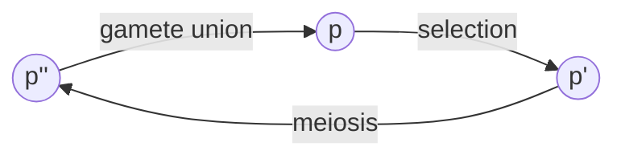

<link rel="stylesheet" href="https://unpkg.com/thebe@latest/lib/thebe.css">

# Lecture 3: Equilibria (univariate)

	Run notes interactively?
	

	

## Lecture overview

1. [Equilibria](#section1)
5. [Example: diploid selection](#section2)
6. [Summary](#section3)

## 1. Equilibria

An **equilibrium** is any state of a system which tends to persist unchanged over time.

For *discrete-time* models, the equilibria are defined as those values of the variables where no changes occur from one time step to the next. 

For example, those values of allele frequency $p(t)$ where

$$
\begin{aligned}
\Delta p &= 0\\
p(t+1) - p(t) &= 0\\
p(t+1) &= p(t)
\end{aligned}
$$

Similarly, for *continuous-time* models, the equilibria are defined as those values of the variables for which the rate of change in the variables equals zero. 

For example, those values of allele frequency $p(t)$ where

$$
\frac{\mathrm{d}p}{\mathrm{d}t} = 0
$$

What are the equilibria of the exponential population growth and haploid selection models discussed in the previous lecture?

## 2. Example: diploid selection

### The model

Let's now consider selection on diploid individuals, where each individual is characterized by two alleles at a locus. This leads to three genotypes: $AA$, $Aa$, and $aa$. The $Aa$ genotype is called the heterozygote and the others are homozygotes.

Let the number of individuals with each genotype be

- $n_{AA}(t) =$ number of individuals with the $AA$ genotype in generation $t$
- $n_{Aa}(t) =$ number of individuals with the $Aa$ genotype in generation $t$
- $n_{aa}(t) =$ number of individuals wite the $aa$ genotype in generation $t$

The frequency of allele $A$ is calculated by counting up all the $A$ alleles in the population and dividing by the total number of alleles,

$$
\begin{aligned}
p(t)
&= \frac{2n_{AA}(t) + n_{Aa}(t)}{2(n_{AA}(t) + n_{Aa}(t) + n_{aa}(t))} \\
&= \frac{n_{AA}(t) + \frac{1}{2}n_{Aa}(t)}{n_{AA}(t) + n_{Aa}(t) + n_{aa}(t)}.
\end{aligned}
$$

To determine the recursion equation, let's use the following life cycle diagram, where we census the population immediately after the diploid individuals are formed by union of the haploid gametes

Now, let’s assume that during selection each diploid individual has reproductive factor

- $W_{AA} =$ reproductive factor of individuals with the $AA$ genotype 
- $W_{Aa} =$ reproductive factor of individuals with the $Aa$ genotype
- $W_{aa} =$ reproductive factor of individuals with the $aa$ genotype

These reproductive factors are again referred to as the absolute fitnesses as they determine the (absolute) numbers of individuals after selection, $n_i' = W_i n_i(t)$ for $i=AA$, $i=Aa$, and $i=aa$.

After selection these genotypes segregate into haploids via meiosis, go through the haploid phase of the life cycle, and then randomly pair to create diploids again. Random union and segregation shuffle alleles between genotypes but don't affect allele frequency. The frequency of $A$ in the next generation is therefore

$$
\begin{aligned}
p(t+1) 
&= \frac{n_{AA}(t+1) + \frac{1}{2}n_{Aa}(t+1)}{n_{AA}(t+1) + n_{Aa}(t+1) + n_{aa}(t+1)}\\
&= \frac{W_{AA}n_{AA}(t) + \frac{1}{2}W_{Aa}n_{Aa}(t)}{W_{AA}n_{AA}(t) + \frac{1}{2}W_{Aa}n_{Aa}(t) + W_{aa}n_{aa}(t)}.
\end{aligned}
$$

We want the recursion equation in terms of allele frequency, so we want to replace the $n_i$'s on the right hand side of this equation with $p$'s. To do this we note that given the random union of gametes the diploid offspring are in Hardy-Weinberg proportions, i.e.,

$$
\begin{aligned}
n_{AA}(t) &= p(t)^2 n(t) \\
n_{Aa}(t) &= 2p(t) (1-p(t)) n(t) \\
n_{aa}(t) &= (1-p(t))^2 n(t)
\end{aligned}
$$

where $n(t) = n_{AA}(t) + n_{Aa}(t) + n_{aa}(t)$ is the total population size.

Substituting these Hardy-Weinberg proportions in and simplifying, the total population size cancels out and we can rewrite the above equation in terms of allele frequency alone,

$$
\begin{aligned}
p(t+1) 
&= \frac{W_{AA}p(t)^2 n(t) + W_{Aa}p(t) (1-p(t)) n(t)}{W_{AA}p(t)^2 n(t) + 2W_{Aa}p(t) (1-p(t)) n(t) + W_{aa}(1-p(t))^2 n(t)}\\
&= \frac{W_{AA}p(t)^2 + W_{Aa}p(t) (1-p(t))}{W_{AA}p(t)^2 + 2W_{Aa}p(t)(1-p(t)) + W_{aa}(1-p(t))^2}.
\end{aligned}
$$

This is a recursion equation for allele frequency in our model of diploid selection. It's a bit long. It can be written quite a bit shorter using $q=1-p$ for the frequency of allele $a$ and noticing that the denominator is mean fitness in the population, $\bar{W}(p(t))$, 

$$
p(t+1) 
= \frac{W_{AA}p(t)^2 + W_{Aa}p(t)q(t)}{\bar{W}(p(t))}.
$$

### The equilibria

To find the equilibria we replace $p(t+1)$ and $p(t)$ with $\hat p$ and the $q(t)$ with $\hat{q}$ and solve for these equilibrium values, $\hat p$ and $\hat q$,

$$
\begin{aligned}
\hat{p} &= \frac{\hat{p}^2 W_{AA} + \hat{p} \hat{q} W_{Aa}}{\hat{p}^2 W_{AA} + 2 \hat{p} \hat{q} W_{Aa} + \hat{q}^2 W_{aa}}\\
\hat{p} &= \frac{\hat{p}(\hat p W_{AA} + \hat{q} W_{Aa})}{\hat{p}^2 W_{AA} + 2 \hat{p} \hat{q} W_{Aa} + \hat{q}^2 W_{aa}}
\end{aligned}
$$

We see that $\hat{p}=0$ is one equilibrium as then both sides of the equation are 0. If $\hat p$ is not 0 we can divide by $\hat p$ to get

$$
\begin{aligned}
1 &= \frac{\hat p W_{AA} + \hat{q} W_{Aa}}{\hat{p}^2 W_{AA} + 2 \hat{p} \hat{q} W_{Aa} + \hat{q}^2 W_{aa}}\\
\hat{p}^2 W_{AA} + 2 \hat{p} \hat{q} W_{Aa} + \hat{q}^2 W_{aa} &= \hat p W_{AA} + \hat{q} W_{Aa}\\
0 &= (\hat{p} - \hat{p}^2) W_{AA} + (\hat{q} - 2 \hat{p} \hat{q}) W_{Aa} - \hat{q}^2 W_{aa}\\
0 &= \hat{p}(1 - \hat{p}) W_{AA} + \hat{q}(1 - 2 \hat{p}) W_{Aa} - \hat{q}^2 W_{aa}\\
0 &= \hat{q}(\hat{p} W_{AA} + (1 - 2 \hat{p}) W_{Aa} - \hat{q} W_{aa})
\end{aligned}
$$

And so $\hat{q}=0\implies\hat{p}=1$ is another equilibrium. Dividing by $\hat{q}$ and putting everything in terms of $p$ we have

$$
\begin{aligned}
0 &= \hat{p} W_{AA} + (1 - 2 \hat{p}) W_{Aa} - \hat{q} W_{aa}\\
0 &= \hat{p} W_{AA} + (1 - 2 \hat{p}) W_{Aa} - (1 - \hat{p}) W_{aa}\\
0 &= \hat{p}(W_{AA} -2W_{Aa} + W_{aa}) + W_{Aa} - W_{aa}\\
W_{aa} - W_{Aa} &= \hat p(W_{AA} -2W_{Aa} + W_{aa})\\
\frac{W_{Aa} - W_{aa}}{2W_{Aa} - W_{AA} - W_{aa}} &= \hat p\\
\end{aligned}
$$

We therefore have *three* equilibria under diploid selection: 

- $\hat{p}=0$
- $\hat p = \frac{W_{Aa} - W_{aa}}{2W_{Aa} - W_{AA} - W_{aa}}$
- $\hat p = 1$

Since a frequency is bounded between 0 and 1, we must have $0 \leq p \leq 1$. We therefore call $\hat{p}=0$ and $\hat{p}=1$ **boundary equilibria**. These bounds also imply the third equilibrium is only **biologically valid** when 

$$
0 \leq \frac{W_{Aa} - W_{aa}}{2 W_{Aa} -W_{AA} - W_{aa}} \leq 1.
$$

When $W_{Aa} = W_{aa}$ this equilibrium reduces to $\hat{p}=0$ and when $W_{Aa} = W_{AA}$ this reduces to $\hat{p}=1$ (check this for yourself). The third equilibrium will be an **internal equilibrium**, representing a population with both $A$ and $a$ alleles, when

$$
0 < \frac{W_{Aa} - W_{aa}}{2 W_{Aa} -W_{AA} - W_{aa}} < 1.
$$

The equilibrium is positive when the numerator and denominator have the same sign (i.e., are both positive or both negative). Let's split this into two "cases". Case A will have a positive numerator, $W_{Aa} > W_{aa}$, and Case B will have a negative numerator, $W_{Aa} < W_{aa}$. So, in Case A, the equilibrium is positive when the denominator is positive, $2 W_{Aa} - W_{AA} - W_{aa} > 0$. Meanwhile in case B the equilibrium is positive when the denominator is negative, $2 W_{Aa} - W_{AA} - W_{aa} < 0$.

Now we can rearrange the equilibrium to show that it is less than 1 when

$$
\begin{aligned}
\frac{W_{Aa} - W_{aa}}{2 W_{Aa} -W_{AA} - W_{aa}} &< 1\\
\frac{W_{Aa} - W_{aa}}{2 W_{Aa} -W_{AA} - W_{aa}} - 1 &< 0\\
\frac{W_{Aa} - W_{aa} - (2 W_{Aa} -W_{AA} - W_{aa})}{2 W_{Aa} -W_{AA} - W_{aa}} &< 0\\
\frac{W_{AA} - W_{Aa}}{2 W_{Aa} -W_{AA} - W_{aa}} &< 0\\
\frac{W_{Aa} - W_{AA}}{2 W_{Aa} -W_{AA} - W_{aa}} &> 0.
\end{aligned}
$$
  
Again, we need the numerator and denominator to have the same sign for this inequality to hold. In case A, where we've said that denominator is positive, this means we also need the numerator to be positive, $W_{Aa} > W_{AA}$. While in case B we said that the denominator is negative, so we also need the numerator to be negative, $W_{Aa} < W_{AA}$.
  
Putting this all together, there is a biologically-relevant internal equilibrium when either

- Case A: $W_{Aa} > W_{aa}$ and $W_{Aa} > W_{AA}$ (which ensures $2 W_{Aa} - W_{AA} - W_{aa} > 0$; go ahead and check!)
- Case B: $W_{Aa} < W_{aa}$ and $W_{Aa} < W_{AA}$  (which ensures $2 W_{Aa} - W_{AA} - W_{aa} < 0$)

Case A therefore represents "heterozygote advantage", $W_{AA} < W_{Aa} > W_{aa}$, while Case B represents "heterozygote disadvantage", $W_{AA} > W_{Aa} < W_{aa}$. 

## 3. Summary

Equilibria are defined by the values of the variables that persist over time, i.e., where the change is zero.

With diploid selection there are three equilibria, two external and one potentially internal -- in the next lecture we'll see which are stable.

Practice questions from the textbook: 5.1-5.3, 5.4a-c, 5.5, 5.8a-b, 5.9a-b, 5.10a-b, 5.11a-b, 5.12a-b, 5.13a-b
