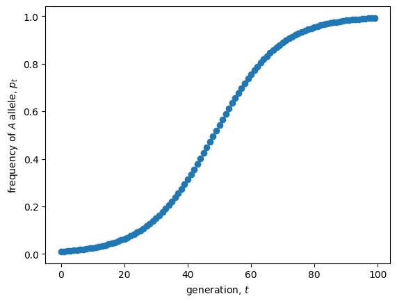

<link rel="stylesheet" href="https://unpkg.com/thebe@latest/lib/thebe.css">

# Lecture 4: Stability (univariate)

	Run notes interactively?
	

	

## Lecture overview

1. [Stability](#section1)
2. [Example: diploid selection](#section2)
3. [Summary](#section3)

## 1. Stability

When a variable ($x$) is exactly at an equilibrium ($\hat x$) its value will never change. But what happens when we are not exactly at, but just near an equilibrium?

Starting near an equilibrium, if the system moves towards the equilibrium over time the equilibrium is said to be **locally stable**. In contrast, if the system moves away from the equilibrium over time the equilibrium is said to be **unstable**.

### Formal analysis

To determine local stability mathematically, we focus on a small perturbation ($\epsilon$) away from an equilibrium and determine whether this perturbation will grow or shrink.
    
Let's do this in discrete time with recursion $x(t+1) = f(x(t))$ where $f(x(t))$ is the function that defines the recursion, e.g., $f(x(t))=Rx(t)$ for exponential population growth.

If at time $t$ the variable is a small distance from equilibrium, $x(t) = \hat{x} + \epsilon(t)$, 
then at time $t+1$ the variable will be at $x(t+1) = f(\hat{x} + \epsilon(t))$.

To work with this arbitrary function, $f$, let's introduce a pretty remarkable mathematical fact, the **Taylor Series**.

!!! note "Taylor Series"

    Any function $f(x)$ can be written as an infinite series of derivatives evaluated at $x=a$

    $$
    f(x) = \sum_{k = 0}^{\infty}\frac{f^{(k)}(a)}{k!}(x-a)^k
    $$

    where $f^{(k)}(a)$ is the $k^{\mathrm{th}}$ derivative of the function with respect to $x$, evaluated at point $a$. (See section P1.3 in the textbook for more information).

Taking the Taylor Series of $f(\hat{x} + \epsilon(t))$ around $\epsilon(t)=0$ 

$$
\begin{aligned}
x(t+1) &= f(\hat{x} + \epsilon(t))\\
&= f(\hat{x}) + f^{(1)}(\hat{x})(\hat{x} + \epsilon(t) - \hat{x}) + \frac{f^{(2)}(\hat{x})}{2}(\hat{x} + \epsilon(t) - \hat{x})^2 + \cdots\\
&= f(\hat{x}) + f^{(1)}(\hat{x})\epsilon(t) + \frac{f^{(2)}(\hat{x})}{2}\epsilon(t)^2 + \cdots\\
\end{aligned}
$$

Now, to work with this infinite series we will make an assumption, that we are very the equilibrium, meaning the deviation is small, $\epsilon<<1$. This means that $\epsilon^2$ is even smaller, and $\epsilon^3$ even smaller than that, and so on. By considering small $\epsilon$ we can therefore cut-off our infinite series by ignoring any term with $\epsilon$ to a power greater than 1. This is called a "first order" Taylor series approximation of $f$ around $\epsilon=0$. This assumption is what limits us to determining only *local* stability. Global stability would require us to consider large deviations from the equilibrium as well, which is not possible for even mildly complicated functions, $f$.

Keeping the first order term only, we can solve for the new deviation from the equilibrium, $\epsilon(t+1) = x(t+1) - \hat x$,

$$
\begin{aligned}
x(t+1) &= f(\hat{x}) + f^{(1)}(\hat{x})\epsilon(t)\\
&= \hat{x} + f^{(1)}(\hat{x})\epsilon(t)\\
x(t+1) - \hat x &= f^{(1)}(\hat{x})\epsilon(t)\\
\epsilon(t+1) &= f^{(1)}(\hat{x})\epsilon(t)
\end{aligned}
$$

So the recursion for the deviation from equilibrium, $\epsilon$, is the recursion for exponential population growth with reproductive factor $\lambda = f^{(1)}(\hat{x})$. 

Based on our knowledge of discrete-time exponential growth, we therefore know that the deviation from equilibrium will:

- move from one side of the equilibrium to the other (i.e., oscillate) if $\lambda$ is negative
    - grow if $\lambda < -1$ $\implies\hat{x}$ unstable
    - shrink if $-1 < \lambda < 0$ $\implies\hat{x}$ locally stable

- stay on the same side of the equilibrium (i.e., not oscillate) if $\lambda$ is positive
    - shrink if $0<\lambda<1$ $\implies\hat{x}$ locally stable
    - grow if $1<\lambda$ $\implies\hat{x}$ unstable
    
Local stability in discrete time therefore requires the slope of the recursion to be between -1 and 1 at the equilibrium, 

$$
-1 < f^{(1)}(\hat{x})=\left.\frac{\mathrm{d}x(t+1)}{\mathrm{d}x(t)}\right|_{x(t)=\hat x} < 1.
$$

A very similar analysis in continuous time, where the variable changes accorging to differential equation $df(x)/dt=f(x)$, shows that an equilibrium $\hat x$ is stable if the slope of the differential equation is negative at the equilibrium, 

$$
f^{(1)}(\hat{x}) = \left.\frac{\mathrm{d}}{\mathrm{d}x}\left(\frac{\mathrm{d}x}{\mathrm{d}t}\right)\right|_{x=\hat{x}} < 0.
$$ 

In continuous time there are no oscilations in one dimension because you cannot go past an equilibrium without hitting it.

Notice that these derivatives are the slopes of the curves at the equilibria in the plots of the variables as functions of themselves: $x(t+1)$ and $dx/dt$ as functions of $x(t)$.

## 2. Example: diploid selection

To try this out on a biological example, let's return to diploid selection, where the frequency of the $A$ allele in the next generation is

$$
p(t+1) = \frac{W_{AA}p(t)^2 + W_{Aa}p(t)(1-p(t))}{\bar{W}(p(t))},
$$

where $\bar{W}(p(t)) = W_{AA}p(t)^2 + 2W_{Aa}p(t) (1-p(t)) + W_{aa}(1-p(t))^2$ is the mean fitness in the population, which depends on $p(t)$.

In the previous lecture we found there were three equilibria:

- $\hat p = 0$
- $\hat p = \frac{W_{Aa} - W_{aa}}{2W_{Aa} - W_{AA} - W_{aa}}$
- $\hat p = 1$

Now our job is to find when each of these is locally stable, which requires the slope of the recursion at that point be between -1 and 1, 

$$
-1 < \left.\frac{\mathrm{d}p(t+1)}{\mathrm{d}p(t)}\right|_{p(t)=\hat p} < 1.
$$

To see this visually first, we can draw cobweb plots for particular parameter values. Last lecture we learned that the internal equilibrium is only valid if the hterozygote is most fit $W_{AA} < W_{Aa} > W_{aa}$ (overdominance) or least fit $W_{AA} > W_{Aa} < W_{aa}$ (underdominance), so let's look at parameter values that fall within those two cases.

<pre data-executable="true" data-language="python">
import numpy as np
import matplotlib.pyplot as plt

# recursion
def f(p, WAA, WAa, Waa):
    return (WAA * p**2 + WAa * p * (1 - p)) / (WAA * p**2 + WAa * 2 * p * (1 - p) + Waa * (1 - p)**2)

# generator for cobweb
def pt(p0, WAA, WAa, Waa, max=np.inf):
    t, pnow, pnext = 0, p0, 0 #initial conditions
    while t < max:
        yield pnow, pnext #current value of p(t) and p(t+1), as both are needed for cob-webbing
        pnext = (WAA * pnow**2 + WAa * pnow * (1 - pnow)) / (WAA * pnow**2 + WAa * 2 * pnow * (1 - pnow) + Waa * (1 - pnow)**2) #update p(t+1)
        yield pnow, pnext #current value of p(t) and p(t+1)
        pnow = pnext #update p(t)
        t += 1 #update t
# plot
fig, axs = plt.subplots(1,2, figsize=(10,5))

WAA, Waa = 1, 1
WAas = [2,0.5]
p0= 0.25

for i,WAa in enumerate(WAas): 

    # evaluate
    xs = np.linspace(0,1,100) #allele freqs at time t
    ys = [f(x, WAA, WAa, Waa) for x in xs] #allele freqs at time t+1
    pts = pt(p0, WAA, WAa, Waa, max=10) # initialize generator
    ps = np.array([[x,y] for x,y in pts]) # compute x,y pairs by iterating through generator
    
    # recursion
    axs[i].plot(xs, ys, color='black') #p(t+1) as function of p(t)
    axs[i].plot(xs, xs, color='black', linestyle='--') #1:1 line for reference
    
    # cobwebs
    axs[i].plot(ps[:,0], ps[:,1])

    axs[i].set_xlim(0,1)
    axs[i].set_ylim(0,1)
    axs[i].set_xlabel("allele frequency at $t$, $p(t)$")
    axs[i].set_ylabel("allele frequency at $t+1$, $p(t+1)$")
    axs[i].set_title(r'$W_{AA}=%s, W_{Aa}=%s, W_{aa}=%s$' %(WAA,WAa,Waa))
    
plt.show()
</pre>

    

    

The equilibria are where the solid line intersects the dashed line. Focusing on the internal equilibrium for illustration, we see that the slope at the intersection is less than one (which is the slope of the dashed line) in the left plot and greater than one in the right plot. Correspondingly, we see that the internal equilibrium is stable in the left plot and unstable in the right plot. To more precisely determine the boundary between stability and instability we need to perform our local stability analysis.

We start the stability analysis by taking the derivative of $p(t+1)$ as a function of $p(t)$, using the quotient rule

$$
\begin{aligned}
&\frac{\mathrm{d}}{\mathrm{d}p(t)}\left(\frac{W_{AA}p(t)^2 + W_{Aa}p(t)(1-p(t))}{\bar{W}(p(t))}\right)\\
&=\frac{(2W_{AA}p(t) + W_{Aa}(1-2p(t)))\bar{W}(p(t))}{\bar{W}(p(t))^2}\\
&-\frac{(W_{AA}p(t)^2+W_{Aa}p(t)(1-p(t)))(2W_{AA}p(t)+2W_{Aa}(1-2p(t))-2(1-p(t))W_{aa})}{\bar{W}(p(t))^2}.
\end{aligned}
$$

This is a complicated expression! Fortunately stability is determined by the value of this derivative evaluated at $p(t)=\hat{p}$, which can be considerably simpler. 

Let's start with $\hat{p} = 0$. In this case we have 

$$
\begin{aligned}
\left.\frac{\mathrm{d}p(t+1)}{\mathrm{d}p(t)}\right|_{p(t)=0} &= \frac{W_{Aa}\bar{W}(0)}{\bar{W}(0)^2}\\
&= \frac{W_{Aa}}{\bar{W}(0)}\\
&= \frac{W_{Aa}}{W_{aa}}.
\end{aligned}
$$

And similarly for $\hat p = 1$, we have

$$
\begin{aligned}
\left.\frac{\mathrm{d}p(t+1)}{\mathrm{d}p(t)}\right|_{p(t)=1} &= \frac{(2W_{AA} - W_{Aa})\bar{W}(1) - W_{AA}(2W_{AA}-2W_{Aa})}{\bar{W}(1)^2}\\
&= \frac{(2W_{AA} - W_{Aa})W_{AA} - W_{AA}(2W_{AA}-2W_{Aa})}{W_{AA}^2}\\
&= \frac{2W_{AA} - W_{Aa} - 2W_{AA}+2W_{Aa}}{W_{AA}}\\
&= \frac{W_{Aa}}{W_{AA}}.
\end{aligned}
$$

Since fitness is always greater than or equal to zero, $W_i\geq0$, so are these derivatives. We therefore know that they are greater than -1 and what is left for stability is to determine when they are less than 1. This will occur whenever the numerator is less than the denominator, meaning that $\hat p = 0$ is stable when $W_{Aa} < W_{aa}$ and $\hat p = 1$ is stable when $W_{Aa} < W_{AA}$. This makes good sense. Take $\hat p = 0$ for example. This means that the $a$ allele is fixed. When we introduce just a few $A$ alleles, $p(t) << 1$, they will occur in heterozygotes because it is very unlikely that they pair with each other under under random mating, $p(t)^2\approx0$. So the spread of the $A$ allele and an increase in $p$ is determined by the spread of the heterozygote, which is prevented by selection when $W_{Aa} < W_{aa}$. The same reasoning holds for $\hat p = 1$. Check that these stability criteria are consistent with the cobweb plots above.

Now for the internal equilibrium. It's stability is determined the same way, but this time we skip the algebra for the sake of time

$$
\begin{aligned}
\left.\frac{\mathrm{d}p(t+1)}{\mathrm{d}p(t)}\right|_{p(t)=\frac{W_{Aa} - W_{aa}}{2W_{Aa} - W_{AA} - W_{aa}}} &= \frac{W_{AA}W_{Aa}-2W_{AA}W_{aa}+W_{Aa}W_{aa}}{W_{Aa}^2-W_{AA}W_{aa}}.
\end{aligned}
$$

Not bad. Now let's consider the two scenarios under which this internal equilibrium is biologically valid.

In case A we have overdominance, $W_{AA} < W_{Aa} > W_{aa}$. This means that both numerator and denominator are positive. Since the derivative is positive it is always greater than -1 and all that is left for stability is for the derivative to be less than 1, ie the numerator is less than the denominator

$$
\begin{aligned}
W_{AA}W_{Aa}-2W_{AA}W_{aa}+W_{Aa}W_{aa} &< W_{Aa}^2-W_{AA}W_{aa}\\
W_{AA}W_{Aa}-W_{AA}W_{aa}+W_{Aa}W_{aa} - W_{Aa}^2 &< 0,
\end{aligned}
$$

which is always true with $W_{AA} < W_{Aa} > W_{aa}$, implying stability with overdominance.

In case B we have underdominance, $W_{AA} > W_{Aa} < W_{aa}$. This means that both numerator and denominator are negative. Since the derivative is positive it is always greater than -1 and all that is left for stability is for the derivative to be less than 1, which is the condition we just derived in the equation above. In case B however, the condition never holds, implying instability with underdominance.

In sum, the internal equilibrium is biologically valid and locally stable only if there is overdominance, $W_{AA} < W_{Aa} > W_{aa}$. This makes good intuitive sense since there are more heterozygotes at a more intermediate frequency ($2p(1-p)$ has a max at $p=1/2$). It also implies that the internal equilibrium is stable when the boundary equilibria are unstable, and vice versa. When the internal equilibrium is unstable it therefore acts as a replellor between two locally stable equilibria, pushing allele frequency towards the boundary that is on the same side of the repellor. Check that this all makes sense with the plots above.

## 3. Summary

Local stability analysis for discrete- and continuous-time models with one variable:

1. take the derivative of the recursion or differential equation with respect to the variable, $f^{(1)}(x)$
2. plug in the equilibrium value of the variable, $\lambda=f^{(1)}(\hat x)$
3. local stability requires $-1 < \lambda < 1$ in discrete time and $\lambda < 0$ in continuous time

Practice questions from the textbook: 5.4, 5.6-5.13
