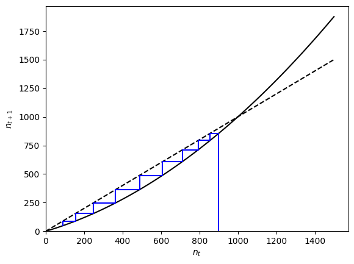

<link rel="stylesheet" href="https://unpkg.com/thebe@latest/lib/thebe.css">

# Lecture 8: General solutions for linear multivariate models

	Run notes interactively?
	

	

## Lecture overview

1. [Motivation](#section1)
2. [Finding eigenvalues](#section2)
3. [Finding eigenvectors](#section3)
4. [Motivation revisited](#section4)
5. [Summary](#section5)

## 1. Motivation

Let's return to our model of the number of birds on two islands and switch to discrete time (assuming migration, then birth, then death). The number of birds on each island in the next time step is then

$$
\begin{aligned}
n_1(t+1) &= ((1-m_{21})n_1(t) + m_{12}n_2(t))(1+b_1)(1-d_1) + m_1\\
n_2(t+1) &= (m_{21}n_1(t) + (1-m_{12})n_2(t))(1+b_2)(1-d_2) + m_2.
\end{aligned}
$$

Or in matrix form,

$$
\begin{aligned}
\vec{n}(t+1) &= \mathbf{M}\vec{n}(t) + \vec{m},
\end{aligned}
$$

where

$$
\mathbf{M} = 
\begin{pmatrix} 
(1-m_{21})(1+b_1)(1-d_1) & m_{12}(1+b_1)(1-d_1) \\ 
m_{21}(1+b_2)(1-d_2) & (1-m_{12})(1+b_2)(1-d_2)
\end{pmatrix}
$$

and 

$$
\vec{m} = 
\begin{pmatrix} 
m_1 \\
m_2.
\end{pmatrix}.
$$

The question we now want to answer is, how do the numbers of birds on the two islands change over time?

We start by noting that the equilibrium is

$$
\begin{aligned}
\hat{\vec{n}} &= \mathbf{M}\hat{\vec{n}} + \vec{m}\\
-\vec{m} &= \mathbf{M}\hat{\vec{n}} - \hat{\vec{n}}\\
-\vec{m} &= \mathbf{M}\hat{\vec{n}} - \mathbf{I}\hat{\vec{n}} \\
-\vec{m} & = (\mathbf{M} - \mathbf{I})\hat{\vec{n}}\\
-(\mathbf{M} - \mathbf{I})^{-1}\vec{m} & = \hat{\vec{n}}
\end{aligned}
$$

and the deviation from this equilibrium, $\vec{\delta}(t) = \vec{n}(t) - \hat{\vec{n}}$, obeys

$$
\begin{aligned}
\vec{\delta}(t+1) &= \vec{n}(t+1) - \hat{\vec{n}}\\
&= \mathbf{M}\vec{n}(t) + \vec{m} - \hat{\vec{n}}\\
&= \mathbf{M}(\vec{\delta}(t) + \hat{\vec{n}}) + \vec{m} - \hat{\vec{n}}\\
&= \mathbf{M}\vec{\delta}(t) + \mathbf{M}\hat{\vec{n}} - \mathbf{I}\hat{\vec{n}}  + \vec{m}\\
&= \mathbf{M}\vec{\delta}(t) + (\mathbf{M} - \mathbf{I})\hat{\vec{n}}  + \vec{m}\\
&= \mathbf{M}\vec{\delta}(t) - \vec{m}  + \vec{m}\\
&= \mathbf{M}\vec{\delta}(t).
\end{aligned}
$$

This is (multivariate) exponential growth, which can be solved by brute force iteration,

$$
\begin{aligned}
\vec{\delta}(t) &= \mathbf{M}\vec{\delta}(t-1)\\
&= \mathbf{M}\mathbf{M}\vec{\delta}(t-2)\\
 &= \mathbf{M}^2\vec{\delta}(t-2)\\
&\vdots\\
&= \mathbf{M}^t\vec{\delta}(0).
\end{aligned}
$$

Great! We now have the general solution,

$$
\begin{aligned}
\vec{\delta}(t) &= \mathbf{M}^t\vec{\delta}(0)\\
\vec{n}(t) - \hat{\vec{n}} &= \mathbf{M}^t(\vec{n}(0) - \hat{\vec{n}})\\
\vec{n}(t) &= \mathbf{M}^t(\vec{n}(0) - \hat{\vec{n}}) + \hat{\vec{n}}.
\end{aligned}
$$

The trouble is that it will generally be hard to compute $\mathbf{M}^t$ (if you don't believe me, try calculating $\begin{pmatrix} a & b \\ c & d \end{pmatrix}^3$).

Now imagine that there existed an invertible matrix $\mathbf{A}$ and a diagonal matrix $\mathbf{D}$ that satisfied $\mathbf{M} \mathbf{A} = \mathbf{A} \mathbf{D}$. Then

$$
\begin{aligned}
\mathbf{M} \mathbf{A} &= \mathbf{A} \mathbf{D}\\
\mathbf{M} \mathbf{A}\mathbf{A}^{-1} &= \mathbf{A} \mathbf{D}\mathbf{A}^{-1}\\  
\mathbf{M} &= \mathbf{A} \mathbf{D} \mathbf{A}^{-1}
\end{aligned}
$$

and

$$
\begin{aligned} 
\vec{n}(t) &= \mathbf{M}^t(\vec{n}(0) - \hat{\vec{n}}) + \hat{\vec{n}}\\
&= (\mathbf{A}\mathbf{D}\mathbf{A}^{-1})^t(\vec{n}(0) - \hat{\vec{n}}) + \hat{\vec{n}}\\
&= (\mathbf{A}\mathbf{D}\mathbf{A}^{-1})
(\mathbf{A}\mathbf{D}\mathbf{A}^{-1}) \cdots
(\mathbf{A}\mathbf{D}\mathbf{A}^{-1})
(\vec{n}(0) - \hat{\vec{n}}) + \hat{\vec{n}}\\
&= \mathbf{A}\mathbf{D}(\mathbf{A}^{-1}
\mathbf{A})\mathbf{D}(\mathbf{A}^{-1}\mathbf{A}) \cdots
(\mathbf{A}^{-1}\mathbf{A})\mathbf{D}\mathbf{A}^{-1}
(\vec{n}(0) - \hat{\vec{n}}) + \hat{\vec{n}}\\ 
&= \mathbf{A}\mathbf{D}^t\mathbf{A}^{-1}
(\vec{n}(0) - \hat{\vec{n}}) + \hat{\vec{n}}. 
\end{aligned}
$$

This is much easier to calculate because $\mathbf{D}^t$ is just $\mathbf{D}$ with each of the diagonal elements to the power $t$. It also hints at a way to approximate longer-term dynamics and determine the stability of an equilibrium -- as we will see later.

!!! note "Continuous time"

    A similar analysis can be done in continuous time. If we start with 
    
    $$
    \frac{\mathrm{d}\vec{n}}{\mathrm{d}t} = \mathbf{M}\vec{n} + \vec{m},
    $$
    
    then the general solution is

    $$
    \vec{n}(t) = \mathbf{A}\exp(\mathbf{D}t)\mathbf{A}^{-1}(\vec{n}(0) - \hat{\vec{n}}) + \hat{\vec{n}},
    $$

    where $\hat{\vec{n}}=-\mathbf{M}^{-1}\vec{m}$ and 

    $$
    \exp(\mathbf{D}t) = \begin{pmatrix}
    \exp(\lambda_1 t) & 0 & \cdots & 0\\
    0 & \exp(\lambda_2 t) & \cdots & 0\\
    \vdots & \vdots & \vdots & \vdots\\
    0 & \cdots & 0 & \exp(\lambda_n t).
    \end{pmatrix}
    $$

Now how do we find $\mathbf{A}$ and $\mathbf{D}$? We need $\mathbf{M} \mathbf{A} = \mathbf{A} \mathbf{D}$. Writing $\mathbf{A}$ in terms of its column vectors, $\mathbf{A} = \begin{pmatrix} \vec{v}_1 & \vec{v}_2 \end{pmatrix}$, and denoting the diagonal elements of $\mathbf{D}$ as $\lambda_i$, we can unpack the equation in terms of column vectors,

$$
\begin{aligned}
\mathbf{M} \mathbf{A} &= \mathbf{A} \mathbf{D}\\
\mathbf{M} \begin{pmatrix} \vec{v}_1 & \vec{v}_2 \end{pmatrix} &= \begin{pmatrix} \vec{v}_1 & \vec{v}_2 \end{pmatrix} \begin{pmatrix} \lambda_1 & 0 \\ 0 & \lambda_2 \end{pmatrix}\\  
\begin{pmatrix} \mathbf{M}\vec{v}_1 & \mathbf{M}\vec{v}_2 \end{pmatrix} &= \begin{pmatrix} \lambda_1\vec{v}_1 & \lambda_2\vec{v}_2 \end{pmatrix}.  
\end{aligned}
$$

So to find $\mathbf{A}$ and $\mathbf{D}$ we need to solve $\mathbf{M}\vec{v}_i = \lambda_i\vec{v}_i$. The solutions to this equation are called **eigenvalues** ($\lambda_i$) and their associated right **eigenvectors** ($\vec{v}_i$). 

## 2. Finding eigenvalues

To find the eigenvalues of a matrix, first notice that if we try to use linear algebra to solve for a right eigenvector, $\vec{v}$, we find

$$
\begin{aligned} 
\mathbf{M}\vec{v} &= \lambda\vec{v}\\
\mathbf{M}\vec{v} - \lambda\vec{v} &= \vec{0}\\
\mathbf{M}\vec{v} - \lambda\mathbf{I}\vec{v} &= \vec{0} \\
(\mathbf{M} - \lambda\mathbf{I})\vec{v} &= \vec{0}\\
\vec{v} &= (\mathbf{M} - \lambda\mathbf{I})^{-1}\vec{0} \\
\vec{v} &= \vec{0}.
\end{aligned}
$$

But if $\vec{v} = \vec{0}$ then $\mathbf{A}$ is not invertible. This contradiction implies that we did something wrong in our calculations. The only place we made any assumptions was in our last step, where we assumed $(\mathbf{M} - \lambda\mathbf{I})$ was invertible. We then conclude that $(\mathbf{M} - \lambda\mathbf{I})$ is non-invertible and therefore must have a determinant of zero, $|\mathbf{M} - \lambda\mathbf{I}|=0$. 

Interestingly, this last equation, $|\mathbf{M} - \lambda\mathbf{I}|=0$, gives us a way to solve for the eigenvalues, $\lambda$, without knowing the eigenvectors, $\vec{v}$. The determinant of the $n\times n$ matrix $(\mathbf{M} - \lambda\mathbf{I})$ is an $n^{th}$ degree polynomial in $\lambda$, which is called the **characteristic polynomial** of $\mathbf{M}$. Setting this polynomial equal to zero and solving for $\lambda$ gives the $n$ eigenvalues of $\mathbf{M}$: $\lambda_1,\lambda_2,...,\lambda_n$.

For example, in the $n=2$ case we have

$$
\begin{aligned}
\mathbf{M} - \lambda \mathbf{I} &= \begin{pmatrix} m_{11} & m_{12} \\ m_{21} & m_{22} \end{pmatrix} - \lambda \begin{pmatrix} 1 & 0 \\ 0 & 1 \end{pmatrix}\\
&= \begin{pmatrix} m_{11} & m_{12} \\ m_{21} & m_{22} \end{pmatrix} -  \begin{pmatrix} \lambda & 0 \\ 0 & \lambda \end{pmatrix}\\
&= \begin{pmatrix} m_{11} - \lambda & m_{12} \\ m_{21} & m_{22} - \lambda \end{pmatrix}
\end{aligned}
$$

so that the characteristic polynomial is

$$
\begin{aligned}
|\mathbf{M} - \lambda \mathbf{I} | =& (m_{11}-\lambda)(m_{22}-\lambda)-m_{21} m_{12}\\
=&\lambda^2 - (m_{11}+m_{22})\lambda + (m_{11}m_{22}-m_{21}m_{12})\\
=&\lambda^2 - \mathrm{Tr}(\mathbf{M})\lambda + \mathrm{Det}(\mathbf{M}),
\end{aligned}
$$

where we've introduced the **trace** of a matrix, $\mathrm{Tr}(\mathbf{M})$, which is the sum of the diagonal elements.

Setting this polynomial equal to zero, the two solutions can be found using the quadratic formula

$$
\lambda = \frac{\mathrm{Tr}(\mathbf{M}) \pm \sqrt{\mathrm{Tr}(\mathbf{M})^2 - 4\mathrm{Det}(\mathbf{M})}}{2}.
$$

Finding the determinant of $(\mathbf{M} - \lambda\mathbf{I})$ becomes trickier for larger matrices, but we've already learned some helpful properties of determinants that come in handy.

For instance, the eigenvalues of a diagonal or triangular matrix are simply the diagonal elements,

$$
\begin{aligned}
|\mathbf{M} - \lambda \mathbf{I}|
&= \begin{vmatrix} m_{11} - \lambda & 0 & 0 \\ m_{21} & m_{22} - \lambda & 0 \\ m_{31} & m_{32} & m_{33} - \lambda \end{vmatrix}\\
&= (m_{11} - \lambda) (m_{22} - \lambda) (m_{33} - \lambda).
\end{aligned}
$$

Similarly, the eigenvalues of a block-diagonal or block-triangular matrix are the eigenvalues of the submatrices along the diagonal,

$$
\begin{aligned}
|\mathbf{M} - \lambda \mathbf{I}| &= \begin{vmatrix} \begin{pmatrix} m_{11} - \lambda & 0 \\ m_{21} & m_{22} - \lambda \end{pmatrix} & \begin{pmatrix} 0 \\ 0 \end{pmatrix} \\ \begin{pmatrix} m_{31} & m_{32} \end{pmatrix} & \begin{pmatrix} m_{33} - \lambda \end{pmatrix} \end{vmatrix}\\
 &= \begin{vmatrix} m_{11} - \lambda & 0 \\ m_{21} & m_{22} - \lambda \end{vmatrix} \begin{vmatrix} m_{33} - \lambda \end{vmatrix}\\
&= (m_{11} - \lambda) (m_{22} - \lambda) (m_{33} - \lambda).
\end{aligned}
$$

## 3. Finding eigenvectors

Now that we can find an eigenvalue, how do we find its associated eigenvectors?

We know we can't solve $\mathbf{M}\vec{v} = \lambda \vec{v}$ for $\vec{v}$ with linear algebra because $(\mathbf{M} - \lambda\mathbf{I})$ is singular. Instead we need to write out the system of equations represented by $\mathbf{M}\vec{v} = \lambda \vec{v}$ and solve for one variable after another.

For example, for a $2 \times 2$ matrix $\mathbf{M}$ with eigenvalues $\lambda_1$ and $\lambda_2$ we know that a right eigenvector associated with $\lambda_1$, $\vec{v}_1$, must solve

$$
\begin{aligned}
\mathbf{M}\vec{v}_1 &= \lambda_1 \vec{v}_1\\
\begin{pmatrix}
  m_{11} & m_{12} \\
  m_{21} & m_{22}
\end{pmatrix}
\begin{pmatrix}
  v_1 \\
  v_2
\end{pmatrix} &= \lambda_1
\begin{pmatrix}
  v_1 \\
  v_2
\end{pmatrix}.
\end{aligned}
$$

Carrying out the matrix multiplication, we can write down a system of equations corresponding the the rows,

$$
\begin{aligned}
m_{11} v_1 + m_{12} v_2 &= \lambda_1 v_1 \\
m_{21} v_1 + m_{22} v_2 &= \lambda_1 v_2.
\end{aligned}
$$

This system of equations determines the elements of the right eigenvector, $\vec{v}_1$, associated with $\lambda_1$.

Note from $\mathbf{M}\vec{v} = \lambda \vec{v}$ that we can multiply $\vec{v}$ by any constant and that will also be a solution. This means there are an infinite number of eigenvectors associated with an eigenvalue and we can set one of the elements to an arbitrary value. A typical choice is to set the first entry equal to one, $v_1 = 1$.

Now we have just one unknown, $v_2$, so we can choose either of the equations above to solve for $v_2$. We pick the first, giving

$$
\begin{aligned}
m_{11} v_1 + m_{12} v_2 &= \lambda_1 v_1 \\
m_{11} 1 + m_{12} v_2 &= \lambda_1 1 \\
v_2 &= (\lambda_1 - m_{11}) / m_{12}.
\end{aligned}
$$

We therefore have right eigenvector $\vec{v}_1 =  \begin{pmatrix} 1 \\ (\lambda_1 - m_{11})/m_{12} \end{pmatrix}$ associated with the eigenvalue $\lambda_1$. 

Because we've done this quite generally, we also now know that the right eigenvector associated with the second eigenvalue, $\lambda_2$, is $\vec{v}_2 = \begin{pmatrix} 1 \\ (\lambda_2 - m_{11})/m_{12} \end{pmatrix}$.

Dependence of the eigenvectors on $m_{21}$ and $m_{22}$ will come through the eigenvalues, $\lambda_i$.

## 4. Motivation revisited

 

Now let's return to our motivating example of birds on islands. And let's imagine we have good estimates of the parameter values (after years of tough fieldwork!): $m_{12}=m_{21}=0.1$, $b_1=b_2=0.2$, $d_1=d_2=0.3$, $m_1=10$, and $m_2=5$. To derive the general solution, giving the number of birds on the two islands in year $t$, we first derive the eigenvalues and eigenvectors of $\mathbf{M}$. Using the techniques above we find that the eigenvalues are $\lambda_1=0.672$ and $\lambda_2=0.84$. The associated right eigenvectors are $\vec{v}_1=\begin{pmatrix} 1 \\ 1 \end{pmatrix}$ and $\vec{v}_2=\begin{pmatrix} 1 \\ -1 \end{pmatrix}$. We therefore have 

$$
\mathbf{D} = \begin{pmatrix} 0.672 & 0 \\ 0 & 0.84 \end{pmatrix}
$$ 

and 

$$
\mathbf{A} = \begin{pmatrix} 1 & 1 \\ 1 & -1 \end{pmatrix}.
$$

This year's census of the islands tells us that there are currently 100 birds on island 1 and 50 on island 2. Taking this as the starting point, $\vec{n}(0) = \begin{pmatrix} 100 \\ 50 \end{pmatrix}$, we can use our general solution to predict the number of birds on the two islands over time. Below we plot the predicted number of birds on the two islands over the next 50 years.

<pre data-executable="true" data-language="python">
m12, m21, b1, b2, d1, d2, m1, m2 = 0.1, 0.1, 0.2, 0.2, 0.3, 0.3, 10, 5 #parameter values
t = symbols('t')

# general solution
from sympy import *
M = Matrix([[(1-m21)*(1+b1)*(1-d1), m12*(1+b1)*(1-d1)], #matrix
            [m21*(1+b2)*(1-d2), (1-m12)*(1+b2)*(1-d2)]])
A, D = M.diagonalize() #quick way to get matrix of right eigenvectors (A) and eigenvalues (D)
n0 = Matrix([100,50]) #note this is made into a column vector automatically
m = Matrix([m1,m2])
nhat = -(M - eye(2)).inv()*m
nt = A*D**t*A.inv()*(n0-nhat) + nhat #general solution

# plot
import matplotlib.pyplot as plt
fig, ax = plt.subplots()
for j in range(2): #for each island
    ax.plot([nt.subs(t,i)[j] for i in range(50)], label='island %d'%(j+1), marker=".")
ax.legend()
ax.set_xlabel('years from now')
ax.set_ylabel('number of birds')
ax.set_ylim(0,None)
plt.show()
</pre>

    

    

## 5. Summary

To summarize,  

- for any system of linear recursion equations, $\vec{x}(t+1) = \mathbf{M}\vec{x}(t) + \vec{m}$, we can write the general solution as $\vec{x}(t) = \mathbf{A}\mathbf{D}^t\mathbf{A}^{-1}(\vec{x}(0)-\hat{\vec{x}}) + \hat{\vec{x}},$ where $\hat{\vec{x}}=-(\mathbf{M} - \mathbf{I})^{-1}\vec{m}$ is the equilibrium, $\mathbf{A}$ is a matrix with right eigenvectors as columns, and $\mathbf{D}$ is a diagonal matrix with eigenvalues along the diagonal
- similarly, for any system of linear differential equations, $\mathrm{d}\vec{x}/\mathrm{d}t = \mathbf{M}\vec{x} + \vec{m}$, we can write the general solution as $\vec{x}(t) = \mathbf{A}\exp(\mathbf{D}t)\mathbf{A}^{-1}(\vec{x}(0)-\hat{\vec{x}}) + \hat{\vec{x}},$ where $\hat{\vec{x}}=-\mathbf{M}^{-1}\vec{m}$ is the equilibrium, $\mathbf{A}$ is a matrix with right eigenvectors as columns, and $\mathbf{D}$ is a diagonal matrix with eigenvalues along the diagonal
- the eigenvalues, $\lambda$, are found by solving $|\mathbf{M} - \lambda\mathbf{I}|=0$
- the right eigenvectors, $\vec{v}$, are found by solving the equations given by $\mathbf{M}\vec{v}=\lambda\vec{v}$

Practice problems from the text book: P2.12-P2.14, 9.1-9.3.

<pre data-executable="true" data-language="python">

</pre>
