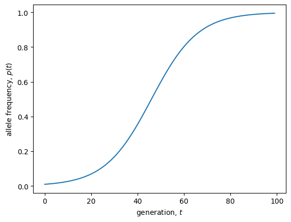

<link rel="stylesheet" href="https://unpkg.com/thebe@latest/lib/thebe.css">

# Lecture 9: General solutions (univariate)

	Run notes interactively?
	

	

## Lecture overview

1. [General solutions](#section1)
2. [Linear models in discrete time](#section2)
3. [Nonlinear models in discrete time](#section3)
4. [Linear models in continuous time](#section4)
5. [Nonlinear models in continuous time](#section5)
6. [Summary](#section6)

## 1. General solutions

Last week we learned how to find **equilibria** and determine their **local stability** in models with one variable (univariate).

Those analyses describe the *long-term dynamics* of our models, i.e., what we expect after a long time has passed.

This week we’ll look at some simple cases where we can describe the *entire* dynamics, including the short-term, by solving for the variable as a function of time, $x_t = f(t)$ 

This is called a **general solution**.

## 2. Linear models in discrete time

With a single variable, $x$, in discrete time all **linear models** can be written 

$$
x_{t+1} = a x_t + b
$$

There are two cases that we will consider separately: 1) $b = 0$ and 2) $b \neq 0$.

### Brute force iteration

When $b = 0$ we can use **brute force iteration**

$$
\begin{aligned}
x_t &= a x_{t-1}\\
&= a a x_{t-2}\\
&= a a a x_{t-3}\\ 
&\vdots\\
&= a\cdots a x_0\\
&= a^t x_0
\end{aligned}
$$   

This is the general solution for exponential growth in discrete time, with reproductive factor $a$. We can see that our variable will oscillate around the equilibrium ($\hat{x}=0$) if $a<0$ and will either approach the equilibrium ($|a|<1$) or depart from it ($|a|>1$), consistent with our local stability analysis. See this for yourself by playing with the value of $a$ in the plot below.  

<pre data-executable="true" data-language="python">
import matplotlib.pyplot as plt
a, x0 = 0.99, 10 #define parameter values and initial condition
ts = range(1000) #time values
xs = [a**t * x0 for t in ts] #variable values from general solution
plt.scatter(ts, xs) #plot discretely
plt.ylabel('$x(t)$')
plt.xlabel('$t$')
plt.show()
</pre>

    

    

### Solving affine models

When $b \neq 0$ (which gives us what is called an **affine model**) we need to use a **transformation**, much like we did when determining local stability.

**Step 1**: Solve for the equilibrium

$$
\begin{aligned}
\hat{x} &= a \hat{x} + b \\
\hat{x} &= \frac{b}{1 - a}
\end{aligned}
$$

!!! note
   
    Note that if $a=1$ there is no equilibrium for $b\neq0$, and instead you can use brute force iteration to show that $x_t = x_0 + b t$.

**Step 2**: Define $\delta_t = x_t - \hat{x}$, the deviation of our variable from the equilibrium (this is our transformation).

**Step 3**: Write the recursion equation for the transformed variable

$$
\begin{aligned}
\delta_{t+1} &= x_{t+1} - \hat{x} \\
&= a x_t + b - \hat{x} \\
&= a(\delta_t + \hat{x}) + b - \hat{x}\\
&= a \left(\delta_t + \frac{b}{1 - a}\right) + b - \frac{b}{1 - a}\\
&= a \delta_t
\end{aligned}
$$

**Step 4**: This is the same recursion we derived above for $x$ when $b=0$. So the general solution for the transformed variable is $\delta_t = a^t \delta_0$.

**Step 5**: Reverse transform back to $x_t$

$$
\begin{aligned}
x_t &= \delta_t + \hat{x}\\
&= a^t \delta_0 + \hat{x}\\
&= a^t (x_0 - \hat{x}) + \hat{x}\\
&= a^t x_0 + (1 - a^t)\hat{x}
\end{aligned}
$$

This says that our variable moves from $x_0$ towards/away from $\hat{x}$ by a factor $a$ per time step. Note that if $b=0$ then $\hat{x}=0$ and this reduces to what we derived above, $x_t=a^t x_0$.

Below we plot the general solution for a given value of $a$ and $b$ from a number of different intitial conditions. Try playing with the values of $a$ and $b$ and observe the different dynamics.

<pre data-executable="true" data-language="python">
a, b, x0 = 0.99, 1, 10 #define parameter values and initial condition
ts = range(1000) #time values
xs = [a**t * x0 + (1-a**t)*b/(1-a) for t in ts] #variable values from general solution
plt.scatter(ts, xs) #plot discretely
plt.ylabel('$x(t)$')
plt.xlabel('$t$')
plt.show()
</pre>

    

    

## 3. Nonlinear models in discrete time

Unfortunately there is no recipe to solve **nonlinear models** in discrete time, even with one variable.
  
In fact, most of the time there is no general solution.

To get a sense of why that might be, remember the chaos of logistic growth!

<pre data-executable="true" data-language="python">
import numpy as np

# Generator for logistic growth
def n(n0, r, k, max=np.inf):
    t, nt = 0, n0
    while t < max:
        yield nt
        t, nt = t + 1, nt + r * nt * (1 - nt / k)

# Sample the periodicity of the oscillations by taking unique values after reaching carrying capacity
def log_map(r, n0=900, k=1000):    
    return np.unique([nt for t, nt in enumerate(n(n0, r, k, max=75)) if t > 30])

# Compute the logistic map for different growth rates in discrete time
r, Nr = np.array([]), np.array([])
for i in np.linspace(1.5, 3, 1000):
    nl = log_map(i)
    r = np.hstack((r, [i for _ in range(len(nl))]))
    Nr = np.hstack((Nr, nl))
    
# Plot the logistic map on a black background
fig, ax = plt.subplots()
ax.patch.set_facecolor('black')
ax.scatter(r, Nr, s=0.075, color='white')
ax.set_xlabel('intrinsic growth rate, $r$')
ax.set_ylabel('population size, $n$')
plt.show()
</pre>

    

    

### Solving with transformations 

Sometimes, however, you can find a **transformation** that works.
  
For example, with haploid selection we have

$$
p_{t+1} = \frac{W_A p_t}{W_A p_t + W_a q_t}
$$

Brute force iteration will create a giant mess.

But what about if we let $f_t = p_t/q_t$?

Noting that $q_{t+1} = 1 - p_{t+1} = (W_a p_t)/(W_A p_t + W_a q_t)$ we have

$$
\begin{aligned}
f_{t+1} &= \frac{p_{t+1}}{q_{t+1}}\\
&= \frac{W_A p_t}{W_a q_t}\\
&= \frac{W_A}{W_a} f_t
\end{aligned}
$$

This implies that $f_t = (W_A/W_a)^t f_0$!

Converting back to $p_t$ we see

$$
p_t = \frac{f_t}{1-f_t} = \frac{W_A^t p_0}{W_A^t p_0 + W_a^t q_0}
$$

### Solving with conceptualization

An alternative way to derive this general solution is to think about ("conceptualize") the $A$ and $a$ alleles as two competing populations that each grow exponentially according to their fitness

$$
\begin{aligned}
n_A(t) &= W_A^t n_A(0)\\
n_a(t) &= W_a^t n_a(0)   
\end{aligned}
$$

Then the frequency of allele $A$ at time $t$ is

$$
p_t = \frac{n_A(t)}{n_A(t) + n_a(t)} = \frac{W_A^t n_A(0)}{W_A^t n_A(0) + W_a^t n_a(0)}
$$

Dividing numerator and denominator by the total initial population size $n_A(0) + n_a(0)$

$$
p_t = \frac{W_A^t p_0}{W_A^t p_0 + W_a^t q_0}
$$

Below we plot this general solution for a given $W_A$, $W_a$, and $p_0$.

<pre data-executable="true" data-language="python">
WA, Wa, p0 = 1.1, 1, 0.01 #define parameter values and initial condition
ts = range(100) #time values
ps = [(WA**t * p0)/(WA**t * p0 + Wa**t * (1-p0)) for t in ts] #variable values from general solution
plt.scatter(ts, ps) #plot discretely
plt.ylabel('allele frequency, $p(t)$')
plt.xlabel('generation, $t$')
plt.show()
</pre>

    

    

## 4. Linear models in continuous time

In continuous time, a linear differential equation of one variable can be written

$$
\frac{\mathrm{d}x}{\mathrm{d}t} = a x + b
$$

Let's first look at the case where $b=0$.

### Separation of variables

Here we can use a method called **seperation of variables**.

That is, our differential equation can be written $\mathrm{d}x/\mathrm{d}t = f(x) g(t)$, i.e., we can separate the variables $x$ and $t$.

We can then re-write the equation as  $\mathrm{d}x/f(x) = g(t)\mathrm{d}t$ and take the indefinite integral of both sides.

In our case we have $f(x)=a x$ and $g(t)=1$ so

$$
\begin{aligned}
\int \frac{\mathrm{d}x}{a x} &= \int \mathrm{d}t \\
\frac{\ln(x)}{a} + c_1 &= t + c_2\\
\ln(x) &= a t + c \; \text{(where } c = c_2 - c_1\text{)}\\
x_t &= e^{a t} e^{a c}
\end{aligned}
$$

Plugging in $t=0$ we have $x_0 = e^{a c}$ and so our general solution is

$$
x_t = x_0 e^{at}
$$

This is the general solution for exponential growth in continuous time with growth rate $a$. We see that variable will either converge on ($a<0$) or depart from ($a>0$) the equilibrium ($\hat x=0$), consistent with our local stability analysis. 

<pre data-executable="true" data-language="python">
import matplotlib.pyplot as plt
a, x0 = 0.01, 10 #define parameter values and initial condition
ts = range(1000) #time values
xs = [exp(a*t) * x0 for t in ts] #variable values from general solution
plt.plot(ts, xs) #plot continuously
plt.ylabel('$x(t)$')
plt.xlabel('$t$')
plt.show()
</pre>

    

    

### Using transformations

Now let's consider the case where $b\neq0$.
  
This can also be solved by the method of separation of variables but let's do 
it with a transformation, like we did in discrete time.

**Step 1**: Solve for the equilibrium, 

$$
\begin{aligned}
0 &= a \hat{x} + b\\
\hat{x} &= -b/a
\end{aligned}
$$

**Step 2**: Define $\delta = x - \hat{x}$ as the deviation of the variable from equilibrium.

**Step 3**: Derive the differential equation for $\delta$

$$
\begin{aligned}
\frac{\mathrm{d}\delta}{\mathrm{d}t} &= \frac{\mathrm{d}(x - \hat{x})}{\mathrm{d}t}\\
&= \frac{\mathrm{d}x}{\mathrm{d}t} - \frac{\mathrm{d}\hat{x}}{\mathrm{d}t}\\
&= \frac{\mathrm{d}x}{\mathrm{d}t}\\
&= a x + b\\
&= a (\delta + \hat{x}) + b\\
&= a(\delta + -b/a) + b\\
&= a \delta
\end{aligned}
$$

**Step 4**: This is the same differential equation we had above for $x$ when $b=0$. The general solution is therefore $\delta$ is $\delta_t = \delta_0 e^{a t}$.
    
**Step 5**: Replace $\delta$ with $x - \hat{x}$ to back transform to our original variable

$$
x_t = e^{a t} x_0 + (1 - e^{a t})\hat{x}
$$

Similar to the discrete case (but without the oscillations), this tells us there is an exponential approach to ($a<0$) or departure from ($a>0$) the equilibrium, $\hat{x}$.

Below we plot this general solution for given values of $a$ and $b$ and a range of initial conditions, $x_0$.

<pre data-executable="true" data-language="python">
a, b, x0 = -0.01, 1, 10 #define parameter values and initial condition
ts = range(1000) #time values
xs = [exp(a*t) * x0 + (1-exp(a*t))*(-b/a) for t in ts] #variable values from general solution
plt.plot(ts, xs) #plot continuously
plt.ylabel('$x(t)$')
plt.xlabel('$t$')
plt.show()
</pre>

    

    

## 5. Nonlinear models in continuous time

Some nonlinear differential equations can also be solved. But there is no general recipe.

### Separation of variables

Sometimes separation of variables works, as in the case of logistic growth and haploid selection (which are equivalent in form in continuous-time!).

$$
\begin{aligned}
\frac{\mathrm{d}p}{\mathrm{d}t} &= s p (1-p)\\
\frac{\mathrm{d}p}{s p (1-p)} &= \mathrm{d}t\\
\left(\frac{1}{s p} + \frac{1/s}{1-p}\right) \mathrm{d}p &= \mathrm{d}t \;\text{(method of partial fractions, rule A.19 in the text)}\\
\int \frac{1}{s p} \mathrm{d}p + \int \frac{1}{s(1-p)} \mathrm{d}p &= \int \mathrm{d}t\\
\ln(p)/s - \ln(1 - p)/s + c_1 &= t + c_2 \\
\ln\left(\frac{p}{1-p}\right) &= s t + s c \; \text{(where } c = c_2 - c_1\text{)}\\
\frac{p}{1-p} &= e^{st} e^{sc}
\end{aligned}
$$

Plugging in $t=0$ we have $p_0/(1-p_0) = e^{sc}$. Then solving this linear equation for $p$

$$
p_t = \frac{e^{st} p_0}{1 - p_0 + e^{st} p_0}
$$

This shows essentially the same dynamics as haploid selection in discrete time.

<pre data-executable="true" data-language="python">
s, p0 = 0.1, 0.01 #define parameter values and initial condition
ts = range(100) #time values
ps = [(exp(s*t) * p0)/(1 - p0 + exp(s*t)*p0) for t in ts] #variable values from general solution
plt.plot(ts, ps) #plot continuously
plt.ylabel('allele frequency, $p(t)$')
plt.xlabel('generation, $t$')
plt.show()
</pre>

    

    

### Alternative methods
  
Separation of variables does not always work as it may not be possible to solve the integrals.

However, separation of variables is not the only method.

Box 6.2 in the text describes how to solve three forms of differential equations that are not amenable to separation of variables (ie, that cannot be written like $\mathrm{d}x/\mathrm{d}t = f(x) g(t)$).

## 6. Summary

Today we've covered how to find the **general solution** for some **univariate** models.

We now have three methods to analyze univariate models:

- **numerical** and **graphical** analyses (for particular parameter values)
- finding **equilibria** and determining their **local stability** (general long-term dynamics)
- finding the **general solution** (general short- and long-term dynamics)
