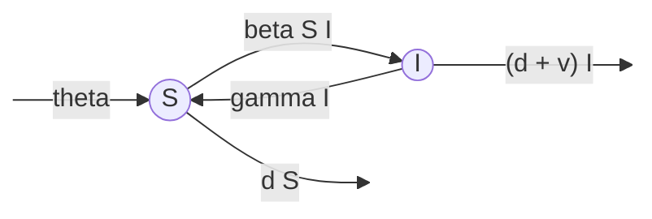
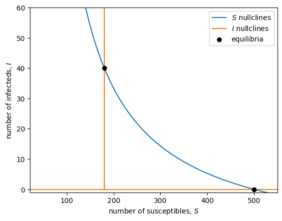

<link rel="stylesheet" href="https://unpkg.com/thebe@latest/lib/thebe.css">

# Lecture 11: Equilibria (nonlinear multivariate)

	Run notes interactively?
	

	

## Lecture overview

1. [Continuous time](#section1)
2. [Discrete time](#section2)
5. [Summary](#section3)

Now that we've covered linear multivariate models, we turn our attention to the more complex, and more common, nonlinear multivariate models.

Let's start by learning how to find equilibria.

## 1. Continuous time

In general, if we have $n$ variables, $x_1, x_2, ..., x_n$, we can write any continuous time model like

$$
\begin{aligned}
\frac{\mathrm{d}x_1}{\mathrm{d}t} &=  f_1(x_1, x_2, ..., x_n)\\
\frac{\mathrm{d}x_2}{\mathrm{d}t} &=  f_2(x_1, x_2, ..., x_n)\\
&\vdots\\
\frac{\mathrm{d}x_n}{\mathrm{d}t} &=  f_n(x_1, x_2, ..., x_n).  
\end{aligned}
$$

If any of these variables interact with one another we do not have a linear system of equations. This prevents us from writing the system of equations in matrix form with a matrix composed only of parameters. And this generally prevents us from solving for equilibrium with linear algebra. To find the equilibria, $\hat{x}_1,\hat{x}_2, ..., \hat{x}_n$, we instead set all these equations to 0 and solve for one variable at a time. 

### Example: epidemiology (the spread of infectious disease)

Consider a population composed of $S$ susceptible individuals and $I$ infected individuals. We assume new susceptible individuals arrive at rate $\theta$ via immigration and existing susceptibles die at per capita rate $d$. We assume infected individuals die at an elevated per capita rate $d+v$ and recover at per capita rate $\gamma$. So far this is a linear (affine) model. Finally, we assume susceptibles become infected at rate $\beta S I$. This is the non-linear part.

We can describe this with the following flow diagram.

The corresponding system of differential equations is

$$\begin{aligned}
\frac{\mathrm{d}S}{\mathrm{d}t} &= \theta - \beta S I - d S + \gamma I \\
\frac{\mathrm{d}I}{\mathrm{d}t} &= \beta S I - (d + v) I - \gamma I.
\end{aligned}$$

At equilibrium both derivatives are equal to zero, 

$$\begin{aligned}
0 &= \theta - \beta \hat{S} \hat{I} - d \hat{S} + \gamma \hat{I} \\
0 &= \beta \hat{S} \hat{I} - (d + v) \hat{I} - \gamma \hat{I} .
\end{aligned}$$

To be systematic, we could start with the first equation and solve for the first variable, $\hat{S}$, in terms of the remaining variables, $\hat{I}$. We could then sub that expression for $\hat{S}$ into the second equation, which would then be an equation for $\hat{I}$ alone. After solving for $\hat{I}$ we could then sub that solution into $\hat{S}$ and be done. But through experience we notice that there is an easier approach. 

Because the second equation is proportional to $\hat{I}$ we immediately know $\hat{I}=0$ is one potential equilibrium point. For this to work we also need the first equation to be zero. Subbing in $\hat{I}=0$ to that first equation and solving for $\hat{S}$ gives $\hat{S}=\theta/d$. One equilibrium is therefore

$$\begin{aligned}
\hat{S} &= \theta/d \\
\hat{I} &= 0,
\end{aligned}$$

which we call the "disease-free" equilibrium. At this equilibrium there is no disease ($\hat{I}=0$) and the number of susceptibles is determined by the balance between immigration and disease-independent death ($\hat{S}=\theta/d$). This is always biologically valid (given the parameters are positive, which we can assume given the description of the model above).

Now, there may be more than one equilibrium because this is a non-linear model. Returning to the second equation, after factoring out $\hat{I}$ we are left with $0 = \beta \hat{S} - (d + v + \gamma)$, implying $\hat{S} = (d + v + \gamma)/\beta$. Plugging this into the first equation and solving for $\hat{I}$ we see that a second equilibrium is

$$\begin{aligned}
\hat{S} &= (d + v + \gamma)/\beta \\
\hat{I} &= \frac{\theta - d(d + v + \gamma)/\beta}{d+v},
\end{aligned}$$

which we call the "endemic equilibrium". This equilibrium is only biologically valid when the numerator of $\hat{I}$ is non-negative which can be rearranged as $\beta\theta/d \geq d + v + \gamma$. When this is an equality the endemic equilbrium reduces to the disease-free equilibrium. 

We can visualize these equilibria by plotting the nullclines on the phase plane. The equilibria are where the nullclines of the two variables intersect.

The nullcline for $S$ is

$$\begin{aligned}
0 &= \theta - \beta S I - d S + \gamma I \\
\beta S I - \gamma I &= \theta - d S \\
(\beta S - \gamma) I &= \theta - d S \\
I &= \frac{\theta - d S}{(\beta S - \gamma)},
\end{aligned}$$

which is undefined at $S=\gamma/\beta$ (in the plot below the nullcline takes on negative $S$ values when $S$ is less than this, so we'll plot only it for $S$ values above this).

The nullclines for $I$ are 

$$\begin{aligned}
0 &= \beta S I - (d + v) I - \gamma I \\
\text{implying} \; I &= 0 \;\text{and} \\
0 &= \beta S - (d + v) - \gamma \\
S &= \frac{d + v + \gamma}{\beta}. 
\end{aligned}$$

<pre data-executable="true" data-language="python">
import matplotlib.pyplot as plt
from sympy import *
import numpy as np

# define the variables
S, I = symbols('S, I')

# Choose the parameter values
d, v = 0.1, 0.7
gamma = 0.1
beta = 0.005
theta = 50

# plot range
Smin = gamma/beta + 1
Smax = 550
Imax = 60
Ss = np.linspace(Smin,Smax,100)
Is = np.linspace(0,Imax,100)

# plot nullclines
Snull = (theta-d*S)/(beta*S-gamma)
Inull0 = 0
Inull1 = (d+v+gamma)/beta
plt.plot(Ss, [Snull.subs(S,i) for i in Ss], label='$S$ nullclines')
plt.plot(Ss, [Inull0 for i in Ss], label='$I$ nullclines')
plt.plot([Inull1 for i in Is], Is, color=plt.cm.tab10(1))

# plot equilibria
eqS = [theta/d,(d+v+gamma)/beta]
eqI = [0,(theta - d*(d+v+gamma)/beta)/(d+v)]
plt.scatter(eqS,eqI,c='k',zorder=5, label='equilibria')

plt.xlabel('number of susceptibles, $S$')
plt.ylabel('number of infecteds, $I$')
plt.xlim(Smin,Smax)
plt.ylim(-1,Imax)
plt.legend()
plt.show()
</pre>

    

    

## 2. Discrete time

In discrete time our system of equations is

$$
\begin{aligned}
x_1(t+1) &=  f_1(x_1(t), x_2(t), ..., x_n(t))\\
x_2(t+1) &=  f_2(x_1(t), x_2(t), ..., x_n(t))\\
&\vdots\\
x_n(t+1) &=  f_n(x_1(t), x_2(t), ..., x_n(t)).
\end{aligned}
$$

Now the equilibria are found by setting all $x_i(t+1) = x_i(t) = \hat{x}_i$ and solving for the $\hat{x}_i$ one at a time.

### Example: Density-dependent natural selection

We previously derived and analyzed an equation for allele frequency change under haploid selection, where the fitness of the two alleles, $A$ and $a$, where constants. Here we explore what happens when the fitness of each allele depends on the number of individuals. We refer to this scenario as density-dependent natural selection. 

Let $p$ be the frequency of allele $A$ and $N=N_A+N_a$ be the total number of individuals in the population. Let the absolute fitness of allele $i$ be $W_i(N)$, a function of population size.  Then the allele frequency and population size in the next generation are

$$\begin{aligned}
p(t+1) &= \frac{W_A(N(t))}{\bar{W}(N(t),p(t))}p(t)\\
N(t+1) &= W_A(N(t))N_A(t) + W_a(N(t))N_a(t) = \bar{W}(N(t),p(t))N(t),
\end{aligned}$$

where $\bar{W}(N(t),p(t)) = W_A(N(t))p(t) + W_a(N(t))(1-p(t))$ is the population mean fitness. 

To be concrete about density-dependence, let the fitness of each type decline exponentially from $1+r$ with population size at rate $\alpha_i$, $W_i(N(t)) = (1+r)\exp(-\alpha_i N(t))$.

Let's start our search for equilibria with the allele frequency equation,

$$\begin{aligned}
\hat{p} &= \frac{W_A(\hat{N})}{\bar{W}(\hat{N},\hat{p})}\hat{p}.
\end{aligned}$$

We see that $\hat{p}=0$ satsifies this. Otherwise we can divide both sides by $\hat{p}$,

$$\begin{aligned}
1 &= \frac{W_A(\hat{N})}{\bar{W}(\hat{N},\hat{p})} \\
\bar{W}(\hat{N},\hat{p}) &= W_A(\hat{N}) \\
W_A(\hat{N})\hat{p} + W_a(\hat{N})(1-\hat{p}) &= W_A(\hat{N}) \\
W_a(\hat{N})(1-\hat{p}) &= W_A(\hat{N})(1-\hat{p}).
\end{aligned}$$

We see that $\hat{p}=1$ satisfies this. Otherwise we can divide both sides by $1-\hat{p}$,

$$\begin{aligned}
W_a(\hat{N}) &= W_A(\hat{N}) \\
(1+r)\exp(-\alpha_a \hat{N}) &= (1+r)\exp(-\alpha_A \hat{N}) \\
\alpha_a \hat{N} &= \alpha_A \hat{N}.
\end{aligned}$$

Unless the two alleles have equal fitness at any population size, $\alpha_A=\alpha_a$, (which we'll ignore) this is only satisfied if the population is extinct, $\hat{N}=0$, in which case we don't care about the allele frequency.

OK, so if the population is not extinct we have either $\hat{p}=0$ or $\hat{p}=1$, aligning with out density-independent analysis earlier in the course. But now what do these equilibrium allele frequencies mean for equilibrium population size? 

When $\hat{p}=0$ we have  

$$\begin{aligned}
\hat{N} &= W_a(\hat{N}) \hat{N} \\
1 &= W_a(\hat{N}) \\
1 &= (1+r)\exp(-\alpha_a \hat{N}) \\
\exp(\alpha_a \hat{N}) &= (1+r)\\
\alpha_a \hat{N} &= \ln(1+r)\\
\hat{N} &= \ln(1+r)/\alpha_a.
\end{aligned}$$

Similarly, when $\hat{p}=1$ we have $\hat{N} = \ln(1+r)/\alpha_A$.

To summarize, there are three equilibria in this model of density-dependent haploid selection:

- extinction, $\hat{N}=0$ (and any allele frequency, which is irrelevant)
- fixation of $a$, $\hat{p}=0$, and the associated equilibrium population size, $\hat{N}=\ln(1+r)/\alpha_a$
- fixation of $A$, $\hat{p}=1$, and the associated equilibrium population size, $\hat{N}=\ln(1+r)/\alpha_A$  

## 3. Summary

We find equilibria of nonlinear multivariate models by either 1) setting the differential equations to zero or 2) the variables in the next time step equal to the variables in the current time step and then solving for the variables one by one.

Two important things to note about nonlinear models (multivariate or not):

- there can be more than one equilibrium
- we can't always solve for all (or any) equilibria 
