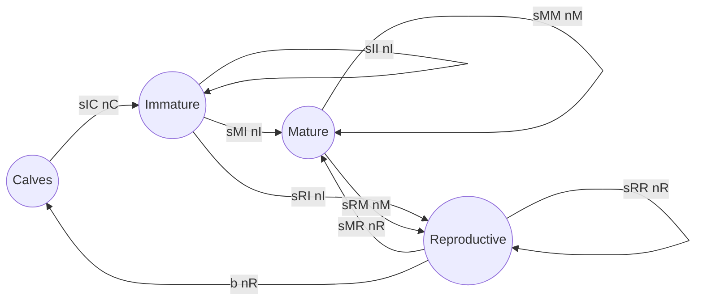
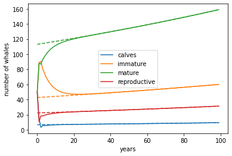
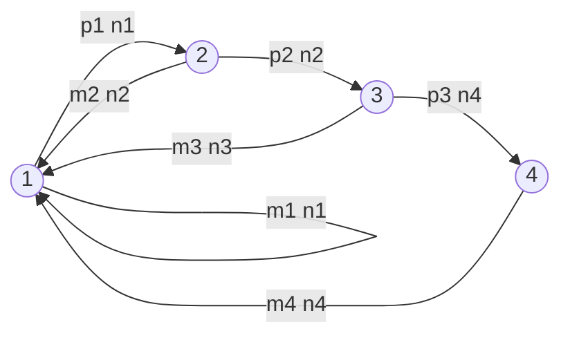

<link rel="stylesheet" href="https://unpkg.com/thebe@latest/lib/thebe.css">

# Lecture 14: Demography

	Run notes interactively?
	

	

## Lecture overview

1. [Demography](#section1)
2. [Stage-structure](#section2)
3. [Age-structure](#section3)

## 1. Demography

We're now going to use what we've learned about **linear multivariate models** to describe the dynamics of a single population that is composed of different types of individuals. This area of research is called **demography**. We'll just consider discrete-time models here.

In the last lecture we saw that for any discrete-time linear multivariate model

$$
\vec{n}(t+1) = \mathbf{M}\vec{n}(t)
$$

we can compute the general solution

$$
\vec{n}(t) = \mathbf{M}^t\vec{n}(0)
$$

or, more conveniently, in terms of the eigenvalues ($\mathbf{D}$) and eigenvectors ($\mathbf{A}$)

$$
\vec{n}(t) = \mathbf{A}\mathbf{D}^t\mathbf{A}^{-1}\vec{n}(0
)
$$

Despite this progress, the eigenvalues and eigenvectors are often unobtainable (without specifying parameter values), leaving us to rely on the long-term approximation

$$
\vec{n}(t) = \lambda_1^t \vec{v}_1 \vec{u}_1 \vec{n}(0)
$$

For this we just need to know the leading eigenvalue ($\lambda_1$) and the corresponding right ($\vec{v}_1$) and left ($\vec{u}_1$) eigenvectors, respectively. (Remember that we have scaled the eigenvectors such that $\vec{u}_1\vec{v}_1=1$.)

These three components ($\lambda_1$, $\vec{v}_1$, $\vec{u}_1$) are the key demographic quantities that we will investigate

- $\lambda_1$ is the **long-term population growth rate**
- $\vec{v}_1$ describes the **stable stage-distribution**
- $\vec{u}_1$ describes the relative **reproductive values** of each stage

!!! note

    The long-term approximation, $\vec{n}(t) = \lambda_1^t \vec{v}_1 \vec{u}_1 \vec{n}(0)$, is valid as long as the leading eigenvalue, $\lambda_1$, is

    - real (no cycles in long-term)
    - positive (no oscillations to negative numbers!)
    - larger than all other eigenvalues (so that we can ignore the other eigenvalues/vectors)

    Fortunately *we are guaranteed all these conditions in our demographic models* since all entries of $\mathbf{M}$ are non-negative and all entries of $\mathbf{M}^t$ are positive for some value of $t$. (This follows from something called the **Perron-Frobenius Theorem**.)
    
The most general demographic model is called **stage-structure**: we consider some finite number of discrete stages that an individual can be in and we use an abitrary matrix of transition rates between stages (a **projection matrix**), $\mathbf{M}$, to project how the population size and composition changes over time.

A common special case is **age-structure**: here we define the stages as the number of time steps an individual has been alive for, which leads to a simpler projection matrix (called a **Leslie matrix**) because individuals always transition to the next stage (or die).

## 2. Stage-structure

### Example: North Atlantic right whale

Let's consider an example (from 10.2 in the text). North Atlantic [right whales](https://en.wikipedia.org/wiki/Right_whale) were hunted to near extinction in the 1800s and early 1900s, after which their population size is thought to have *slowly* recovered (there are less than 400 now, and unfortunately [appear to be in decline again](https://www.fisheries.noaa.gov/species/north-atlantic-right-whale#overview)). Because of their long life span, over which survival and reproductive rates vary enormously, a stage-structured model is very appropriate. Below we draw a flow diagram representing all the transitions between calves, sexually immature individuals, sexually mature individuals, and actively reproducing individuals.

Converting this flow diagram into a system of recursion equations, $\vec{n}(t+1) = \mathbf{M}\vec{n}(t)$, the projection matrix is

$$
\mathbf{M} =
\begin{pmatrix}
0 & 0 & 0 & b \\
s_{IC} & s_{II} & 0 & 0\\
0 & s_{MI} & s_{MM} & s_{MR} \\
0 & s_{RI} & s_{RM} & s_{RR}
\end{pmatrix}
$$
  
If we now plug in some estimated parameter values from the literature ($b=0.3$, $s_{IC}=0.92$, $s_{II}=0.86$, $s_{MI}=0.08$, $s_{MM}=0.8$, $s_{MR}=0.88$, $s_{RI}=0.02$, $s_{RM}=0.19$, $s_{RR}=0$) we can numerically calculate the three key demographic quantities

$$
\begin{aligned}
&\lambda_1 \approx 1.003 \\
&\vec{v}_1 \approx \begin{pmatrix} 0.04 \\ 0.23 \\ 0.61 \\ 0.12\end{pmatrix} \\
&\vec{u}_1 \approx \begin{pmatrix} 0.69 & 0.76 & 1.07 & 1.15 \end{pmatrix}
\end{aligned}
$$

These quantitives tells us, for example, that in the long-run the population is predicted to grow ($\lambda_1>1$), the majority of individuals are expected to be mature (the second last entry in $\vec{v}_1$ is the largest), and mature and reproductive individuals are expected to have much higher reproductive values than calves and immature individuals (the last two entries in $\vec{u}_1$ are much larger than the first two). 

!!! note "Caveat"
    
    The parameter values above were estimated before the current population decline -- changes in climate and human behaviour, eg boat traffic and fishing, have presumably altered the parameter values, making the predictions less accurate. For example, the increased incidence of entanglement in fishing nets has likely decreased survival rates to the point that the population is now expected to decline. See [here](https://www.fisheries.noaa.gov/species/north-atlantic-right-whale#overview) for more info.

We can now answer an important conservation question: 

!!! question 

    If we wanted to increase the total population size in the future and we could add one individual to any stage, which stage should it be?

We want to know what entry of $\vec{n}(0)$ to add 1 to to maximize $\vec{n}(t) \approx \lambda^t \vec{v}_1 \vec{u}_1 \vec{n}(0)$. This will not affect the long-term growth rate ($\lambda_1$) or the stable-stage distribution ($\vec{v}_1$). We can therefore only increase $\vec{u}_1\vec{n}(0) = u_1 n_1(0) + u_2 n_2(0) + ... + u_m n_m(0)$. And so we add 1 to the stage with the largest reproductive value, $u_i$.
   
So for these whales, where the reproductive values are $\vec{u}_1 \approx \begin{pmatrix} 0.69 & 0.76 & 1.07 & 1.15 \end{pmatrix}$, we should add a reproductively active individual. This is perhaps not surprising since those are the only individuals that produce offspring and if we introduced an individual in an earlier stage there is some chance that they would die before becoming reproductively active.

One other question we might now consider is:

!!! question

    If we wanted to increase the long-term population growth rate and we could increase any parameter a little bit, which parameter should it be?

One way to answer this is to numerically calculate the long-term population growth rate, $\lambda_1$, for a range of values of one parameter, $z$ (e.g., we might take $z=b$, the fecundity of reproductive individuals).

Or, we could try to analytically compute the rate of change in the leading eigenvalue with respect to $z$, $\mathrm{d}\lambda_1/\mathrm{d}z$, while considering $\mathbf{M}$, $\lambda_1$, $\vec{v}_1$, and $\vec{u}_1$ to be functions of $z$. 

Since $\mathbf{M}\vec{v}_1 = \lambda_1 \vec{v}_1$ and $\vec{u}_1\mathbf{M} = \vec{u}_1\lambda_1$ we have

$$
\begin{aligned}
\mathbf{M} \vec{v}_1 &= \lambda_1 \vec{v}_1 \\
\vec{u}_1 \mathbf{M} \vec{v}_1 &= \vec{u}_1 \lambda_1 \vec{v}_1 \\
\frac{\mathrm{d}}{\mathrm{d}z} \left(\vec{u}_1 \mathbf{M} \vec{v}_1 \right)&= \frac{\mathrm{d}}{\mathrm{d}z} \left(\vec{u}_1 \lambda_1 \vec{v}_1 \right)\\
\frac{\mathrm{d}\vec{u}_1}{\mathrm{d}z} \mathbf{M} \vec{v}_1 + \vec{u}_1 \frac{\mathrm{d}\mathbf{M}}{\mathrm{d}z} \vec{v}_1 + \vec{u}_1 \mathbf{M} \frac{\mathrm{d}\vec{v}_1}{\mathrm{d}z} &= \frac{\mathrm{d}\vec{u}_1}{\mathrm{d}z} \lambda_1 \vec{v}_1 + \vec{u}_1 \frac{\mathrm{d}\lambda_1}{\mathrm{d}z} \vec{v}_1 + \vec{u}_1 \lambda_1 \frac{\mathrm{d}\vec{v}_1}{\mathrm{d}z}\\
\vec{u}_1 \frac{\mathrm{d}\mathbf{M}}{\mathrm{d}z} \vec{v}_1 &= \vec{u}_1 \frac{\mathrm{d}\lambda_1}{\mathrm{d}z} \vec{v}_1 \\
\frac{\mathrm{d}\lambda_1}{\mathrm{d}z} &= \frac{\vec{u}_1 \frac{\mathrm{d}\mathbf{M}}{\mathrm{d}z} \vec{v}_1}{\vec{u}_1 \vec{v}_1}
\end{aligned}$$

We call $\mathrm{d}\lambda_1/\mathrm{d}z$ the **sensitivity** of $\lambda_1$ to $z$.

This expression will be too complicated to understand in general in most cases, but we can evaluate at some particular value $z^*$ (e.g., at the current estimate) to see how the growth rate changes as $z$ increases from that value

$$
\frac{\mathrm{d}\lambda_1}{\mathrm{d}z} \bigg|_{z=z^*} = \frac{\vec{u}_1 \left(\frac{\mathrm{d}\mathbf{M}}{\mathrm{d}z} \big|_{z=z^*} \right) \vec{v}_1}{\vec{u}_1 \vec{v}_1}
$$

Returning to our question, we want to know which parameter, $z$, gives the largest value of $\frac{\mathrm{d}\lambda_1}{\mathrm{d}z} \big|_{z=z^*}$.
    
For these whales we can calculate $\frac{\mathrm{d}\lambda_1}{\mathrm{d}z} \big|_{z=z^*}$ for each parameter $z$ (ie, for each entry in $\mathbf{M}$) evaluated at it's current value $z^*$. Doing that calculation we see that increasing the fraction of mature individuals that survive to become reproductively active, $s_{RM}$, has the largest effect. This makes good sense because increasing $s_{RM}$ increases the rate at which the most populous stage (from $\vec{v}_1$) transitions to the stage with the highest reproductive value (from $\vec{u}_1$).

And finally, we can ask

!!! question

    What are the predicted numbers of individuals in each stage over time?

Here we simply plot the general solution (solid) and compare with the long-term approximation (dashed) out of interest. We see that the full solution very quickly converges to the long-term solution in this case. 

<pre data-executable="true" data-language="python">
b,sic,sii,smi,smm,smr,sri,srm,srr = 0.3,0.92,0.86,0.08,0.8,0.88,0.02,0.19,0 #parameter values

import numpy as np

M = np.array([[0,0,0,b], #projection matrix
              [sic,sii,0,0],
              [0,smi,smm,smr],
              [0,sri,srm,srr]])

# calculate
eigs = np.linalg.eig(M) #eigenvalues and right eigenvectors
ix = np.argmax(np.abs(eigs[0])) #which is leading eigenvalue
l1 = eigs[0][ix] #leading eigenvalue
v1 = eigs[1][:,ix] #leading right eigenvector
v1 = v1/np.sum(v1) #normalized to sum to 1
us = np.linalg.inv(eigs[1]) #left eigenvectors
u1 = us[ix] #leading left eigenvalue
u1 = u1/np.dot(u1,v1) #normalized so u1*v1=1

n0 = np.array([50,50,50,50]) #initial state

def ntfull(t):
    '''full projection'''
    return np.dot(np.linalg.matrix_power(M,t), n0)

def ntapp(t):
    '''long term approximation'''
    return l1**t * v1 * np.dot(u1, n0)

# plot
import matplotlib.pyplot as plt

fig, ax = plt.subplots()

labels = ['calves','immature','mature','reproductive']
colors = plt.get_cmap('tab10')
for i,j in enumerate(range(len(M))): #for each stage
    ax.plot([ntfull(t)[j] for t in range(100)], color=colors(i), label=labels[i])
    ax.plot([ntapp(t)[j] for t in range(100)], color=colors(i), linestyle='--') #long-term approx

ax.legend()
ax.set_xlabel('years')
ax.set_ylabel('number of whales')
plt.show()
</pre>

    

    

## 3. Age-structure

Now let's look at the special case of **age-structure**.
  
Here individuals in stage $i$ at time $t$ can only contribute to stage $i+1$ (survival) and stage $1$ (reproduction) at time $t+1$.

    
Because of this, the projection matrix is simpler in the sense that it contains more zeros and has non-zero entries in very specific places

$$
\mathbf{L} = 
\begin{pmatrix}  
m_1 & m_2 & m_3 & \cdots & m_d \\
p_1 & 0 & 0 & \cdots & 0 \\
0 & p_2 & 0 & \cdots & 0 \\
\vdots &  & \vdots &  & \vdots \\  
0 & \cdots & 0 & p_{d-1} & 0\\
\end{pmatrix}
$$

We call it a **Leslie matrix** and often denote it with $\mathbf{L}$. The first row contains the fecundities of each age group, $m_i$, while the entries immediately below the diagonal give the fraction of individuals that survive each age group, $p_i$.

Because of the structure of the Leslie matrix, many expressions are now simpler.

For example, the characteristic polynomial, $\mathrm{Det}(\mathbf{L}-\mathbf{I}\lambda)=0$, can be calculated using the first row. After rearranging we get what is known as the **Euler-Lotka equation**

$$
1 = \sum_{i=1}^{d} \frac{l_i m_i}{\lambda^i}
$$

where $l_1 = 1$, $l_i = p_1 p_2 \cdots p_{i-1}$ is the fraction of individuals that survive from birth to age $i$ and $d$ is the number of ages (ie, $\mathbf{L}$ is a $d\times d$ matrix).

Given the $l_i$ and $m_i$ we can use this equation to find the long-term population growth rate, $\lambda_1$.

### Example: stickleback

For example, let's look at a model of [stickleback](https://en.wikipedia.org/wiki/Stickleback), a small fish (see section 10.6 of the text).

We assume stickleback do not live more than 4 years and estimate the Leslie matrix as

$$
\mathbf{L} = 
\begin{pmatrix}
2 & 3 & 4 & 4\\
0.6 & 0 & 0 & 0 \\
0 & 0.3 & 0 & 0 \\
0 & 0 & 0.1 & 0
\end{pmatrix}
$$

The Euler-Lotka equation is then

$$
\begin{aligned}
1 &= \sum_{i=1}^{4} \frac{l_i m_i}{\lambda^i}\\
1 &= \frac{l_1 m_1}{\lambda} + \frac{l_2 m_2}{\lambda^2} + \frac{l_3 m_3}{\lambda^3} + \frac{l_4 m_4}{\lambda^4}\\
1 &= \frac{2}{\lambda} + \frac{1.8}{\lambda^2} + \frac{0.72}{\lambda^3} + \frac{0.072}{\lambda^4}\\    
\end{aligned}
$$

This can be numerically solved to give our four eigenvalues: $\lambda\approx2.75, -0.3 \pm 0.3i, -0.14$.

The long-term growth rate is the eigenvalue with the largest absolute value, $\lambda_1=2.75$.

!!! note

    We won't spend the time on it in class, but with age-structure we can also write the stable age distribution, reproductive values, and sensitivities as functions of survival, fecundity, and rate of population growth.

    The proportion of individuals that are age $x$ (in the long-run) is

    $$
    v_x = \frac{l_x \lambda_1^{-(x-1)}}{\sum_{i=1}^{d}l_i \lambda_1^{-(i-1)}}
    $$

    The reproductive value of individuals that are age $x$, relative to age $1$, is

    $$
    \frac{u_x}{u_1} = \frac{\lambda_1^{x-1}}{l_x}\sum_{i=x}^{d}\frac{l_i m_i}{\lambda_1^{i}}
    $$

    The sensitivities of the long-term growth rate to survival and reproduction at age $x$ are

    $$
    \frac{\mathrm{d}\lambda_1}{\mathrm{d}p_x} = \frac{v_x u_{x+1}}{\vec{u}_1 \vec{v}_1}
    $$

    $$
    \frac{\mathrm{d}\lambda_1}{\mathrm{d}m_x} = \frac{v_x u_1}{\vec{u}_1 \vec{v}_1}
    $$

    For example, in our stickleback model the proportion of the population that is age $x=2$, in the long-run, is

    $$
    \begin{aligned}
    v_x &= \frac{l_x \lambda_1^{-(x-1)}}{\sum_{i=1}^{d}l_i \lambda_1^{-(i-1)}}\\
    v_2 &= \frac{l_2 \lambda_1^{-1}}{\sum_{i=1}^{4}l_i \lambda_1^{-(i-1)}}\\
    &\approx \frac{0.6 (2.75)^{-1}}{1 (2.75)^{0} + 0.6 (2.75)^{-1} + 0.18 (2.75)^{-2} + 0.018 (2.75)^{-3}}\\
    &\approx 0.18
    \end{aligned}
    $$

    and the relative reproductive value of age $x=2$ individuals is 

    $$
    \begin{aligned}
    \frac{v_x}{v_1} &= \frac{\lambda_1^{x-1}}{l_x}\sum_{i=x}^{d}\frac{l_i m_i}{\lambda_1^{i}}\\
    \frac{v_2}{v_1} &= \frac{\lambda_1^{2-1}}{l_2}\sum_{i=2}^{4}\frac{l_i m_i}{\lambda_1^{i}}\\
    &= \frac{\lambda_1}{l_2} \left(\frac{l_2 m_2}{\lambda_1^{2}} + \frac{l_3 m_3}{\lambda_1^{3}} + \frac{l_4 m_4}{\lambda_1^{i}} \right)\\
    &\approx \frac{2.75}{0.6} \left(\frac{(0.6) (3)}{2.75^{2}} + \frac{(0.18) (4)}{2.75^{3}} + \frac{(0.018) (4)}{2.75^{4}} \right)\\
    &\approx 1.25
    \end{aligned}
    $$

    Repeating these for the other ages we get the stable-age distribution

    $$
    \vec{v}_1 \approx \begin{pmatrix} 0.80 \\ 0.18 \\ 0.02 \\ 0.0007 \end{pmatrix}
    $$

    and the reproductive values

    $$
    \vec{u}_1 \approx \begin{pmatrix} 1 & 1.25 & 1.51 & 1.45 \end{pmatrix}
    $$

    From these we see that the majority of the population is expected to be age 1 (from $\vec{v}_1$) and age 3 has the highest reproductive value (from $\vec{u}_1$).

    We can now use these vectors to calculate the sensitivities of population growth rate to survival

    $$
    \begin{aligned}
    \frac{\mathrm{d}\lambda_1}{\mathrm{d}p_x} &= \frac{v_x u_{x+1}}{\vec{u}_1 \vec{v}_1}\\
    \frac{\mathrm{d}\lambda_1}{\mathrm{d}p_1} &\approx 0.95\\
    \frac{\mathrm{d}\lambda_1}{\mathrm{d}p_2} &\approx 0.25\\ 
    \frac{\mathrm{d}\lambda_1}{\mathrm{d}p_3} &\approx 0.03
    \end{aligned}
    $$

    and to fecundity

    $$
    \begin{aligned}
    \frac{\mathrm{d}\lambda_1}{\mathrm{d}m_x} &= \frac{v_x u_1}{\vec{u}_1 \vec{v}_1}\\
    \frac{\mathrm{d}\lambda_1}{\mathrm{d}m_1} &\approx 0.76\\
    \frac{\mathrm{d}\lambda_1}{\mathrm{d}m_2} &\approx 0.17\\ 
    \frac{\mathrm{d}\lambda_1}{\mathrm{d}m_3} &\approx 0.02\\ 
    \frac{\mathrm{d}\lambda_1}{\mathrm{d}m_4} &\approx 0.0007
    \end{aligned}
    $$

    And so we see that, because such a large proportion of the population is expected to be age 1, increasing the survival and fecundity of that age has the largest effect.

Finally, we can plot the predicted dynamics as we did for the whales above. In this case the population grows very quickly (clearly there is a need to also model density-dependence via competition, otherwise our model predicts that the universe will soon be stuffed-full with sticklback!), so we plot the number of fish of each age on a log scale. Again, we compare the full general solution (solid) to the long-term approximation (dashed) and see quick convergence.

<pre data-executable="true" data-language="python">
m1,m2,m3,m4,p1,p2,p3 = 2,3,4,4,0.6,0.3,0.1 #parameter values

import numpy as np

M = np.array([[m1,m2,m3,m4], #projection matrix
              [p1,0,0,0],
              [0,p2,0,0],
              [0,0,p3,0]])

# calculate
eigs = np.linalg.eig(M) #eigenvalues and right eigenvectors
ix = np.argmax(np.abs(eigs[0])) #which is leading eigenvalue
l1 = eigs[0][ix] #leading eigenvalue
v1 = eigs[1][:,ix] #leading right eigenvector
v1 = v1/np.sum(v1) #normalized to sum to 1
us = np.linalg.inv(eigs[1]) #left eigenvectors
u1 = us[ix] #leading left eigenvalue
u1 = u1/np.dot(u1,v1) #normalized so u1*v1=1

n0 = np.array([25,25,25,25]) #initial state

def ntfull(t):
    '''full projection'''
    return np.dot(np.linalg.matrix_power(M,t), n0)

def ntapp(t):
    '''long term approximation'''
    return l1**t * v1 * np.dot(u1, n0)

# plot
import matplotlib.pyplot as plt

fig, ax = plt.subplots()

labels = ['age 1','age 2','age 3','age 4']
colors = plt.get_cmap('tab10')
for i,j in enumerate(range(len(M))): #for each stage
    ax.plot([ntfull(t)[j] for t in range(10)], color=colors(i), label=labels[i])
    ax.plot([ntapp(t)[j] for t in range(10)], color=colors(i), linestyle='--') #long-term approx

ax.legend()
ax.set_xlabel('years')
ax.set_ylabel('number of stickleback')
ax.set_yscale('log')
plt.show()
</pre>

    

    

