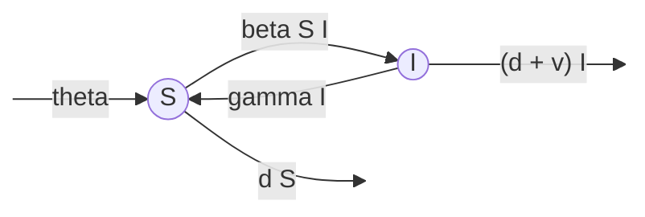

# Lecture 16: Epidemiology

	Run notes interactively?
	

	

## Lecture overview

1. [Epidemiology](#section1)

## 1. Epidemiology

In [Lecture 15](lecture-15.md) we learned how to find equilibria and determine their stability in nonlinear multivariate models. To make this more concrete, let's consider a biological example (see Section 8.2 in the text). 

Consider a population composed of $S$ susceptible individuals and $I$ infected individuals. We assume new susceptible individuals arrive at rate $\theta$ via immigration and existing susceptibles die at per capita rate $d$. We assume infected individuals die at an elevated per capita rate $d+v$ and recover at per capita rate $\gamma$. So far this is a linear (affine) model. Finally, we assume susceptibles become infected at rate $\beta S I$. This is the non-linear part.

We can describe this with the following flow diagram

The corresponding system of differential equations is

$$\begin{aligned}
\frac{\mathrm{d}S}{\mathrm{d}t} &= \theta - \beta S I - d S + \gamma I \\
\frac{\mathrm{d}I}{\mathrm{d}t} &= \beta S I - (d + v) I - \gamma I 
\end{aligned}$$

At equilibrium both derivatives are equal to zero 

$$\begin{aligned}
0 &= \theta - \beta \hat{S} \hat{I} - d \hat{S} + \gamma \hat{I} \\
0 &= \beta \hat{S} \hat{I} - (d + v) \hat{I} - \gamma \hat{I} 
\end{aligned}$$

To be systematic we could start with the first equation and solve for the first variable, $\hat{S}$, in terms of the remaining variables, $\hat{I}$. We could then sub that expression for $\hat{S}$ into the second equation, which would then be an equation for $\hat{I}$ alone. After solving for $\hat{I}$ we could then sub that solution into $\hat{S}$ and be done. But through experience we notice that there is an easier approach. 

Because the second equation is proportional to $\hat{I}$ we immediately know $\hat{I}=0$ is one potential equilibrium point. For this to work we also need the first equation to be zero. Subbing in $\hat{I}=0$ to that first equation and solving for $\hat{S}$ gives $\hat{S}=\theta/d$. One equilibrium is therefore

$$\begin{aligned}
\hat{S} &= \theta/d \\
\hat{I} &= 0
\end{aligned}$$

which we call the "disease-free" equilibrium.

Returning to the second equation, after factoring out $\hat{I}$ we are left with $0 = \beta \hat{S} - (d + v + \gamma)$, implying $\hat{S} = (d + v + \gamma)/\beta$. Plugging this into the first equation and solving for $\hat{I}$ we see that a second equilibrium is

$$\begin{aligned}
\hat{S} &= (d + v + \gamma)/\beta \\
\hat{I} &= \frac{\theta - d(d + v + \gamma)/\beta}{d+v}
\end{aligned}$$

which we call the "endemic equilibrium" because there is some non-zero amount of disease. Note that this equilibrium is only biologically valid when the numerator of $\hat{I}$ is positive which can be rearranged as $\beta\theta/d > d + v + \gamma$.

Now that we have the equilibria, the next step is to calculate the Jacobian. Letting $x_1=S$ and $x_2=I$ we have $f_1(x_1,x_2)=\mathrm{d}S/\mathrm{d}t$ and $f_2(x_1,x_2)=\mathrm{d}I/\mathrm{d}t$. The Jacobian is therefore

$$\begin{aligned}
\mathbf{J} 
&= 
\begin{pmatrix}
\frac{\partial}{\partial S}\left(\frac{\mathrm{d}S}{\mathrm{d}t}\right) & \frac{\partial}{\partial I}\left(\frac{\mathrm{d}S}{\mathrm{d}t}\right) \\
\frac{\partial}{\partial S}\left(\frac{\mathrm{d}I}{\mathrm{d}t}\right) & \frac{\partial}{\partial I}\left(\frac{\mathrm{d}I}{\mathrm{d}t}\right)
\end{pmatrix}\\
&=
\begin{pmatrix}
-d-\beta I & -\beta S+\gamma \\
\beta I & \beta S-(d+v+\gamma)
\end{pmatrix}
\end{aligned}$$

We can now determine the local stability of an equilibrium by evaluating the Jacobian at that equilibrium and calculating the eigenvalues. 

Let's do that first for the simpler disease-free equilibrium, where there are no infected individuals, $\hat{I}=0$, and the number of susceptibles is a balance of immigration and death, $\hat{S} = \theta/d$. Plugging these into the Jacobian gives 

$$\begin{aligned}
\mathbf{J}_\mathrm{disease-free} 
&= 
\begin{pmatrix}
-d & -\beta \theta/d+\gamma \\
0 & \beta \theta/d-(d+v+\gamma)
\end{pmatrix}
\end{aligned}$$

This is an upper triangular matrix, so the eigenvalues are just the diagonal elements, $\lambda = -d, \beta\theta/d-(d+v+\gamma)$. Because all the parameters are rates they are all non-negative, and therefore the only eigenvalue that can have a positive real part (and therefore cause instability) is $\lambda=\beta\theta/d-(d+v+\gamma)$. The equilibrium is unstable when this is positive, $\beta\theta/d-(d+v+\gamma)>0$. Because this equilibrium has no infected individuals, instability in this case means the infected individuals will increase in number from rare -- ie, the disease can spread when rare. 

We can rearrange the instability condition to get a little more intuition. The disease will spread when rare whenever

$$\begin{aligned}
\beta\theta/d - (d+v+\gamma)& > 0 \\
\beta\theta/d &> d+v+\gamma \\
\frac{\beta\theta/d}{d+v+\gamma} &> 1
\end{aligned}$$

The numerator is $\beta$ times the number of susceptibles at the disease-free equilibrium, $\hat{S}=\theta/d$. This is the rate that a rare disease infects new individuals. The denominator is the rate at which the disease is removed from the population. Therefore a rare disease that infects faster than it is removed can spread. This ratio, in our case $\frac{\beta\theta/d}{d+v+\gamma}$, is termed $R_0$ and is a very key epidemiological quantity (you may remember estimates of $R_0$ in the news from a certain recent virus...).

Now for the endemic equilibrium. Plugging these values into the Jacobian and simplifying gives

$$\begin{aligned}
\mathbf{J}_\mathrm{endemic} 
&= 
\begin{pmatrix}
-\frac{\beta \theta - d \gamma}{d+v} & -(d+v) \\
\frac{\beta \theta - d (d+v+\gamma)}{d+v} & 0
\end{pmatrix}
\end{aligned}$$

Here, instead of calculating the eigenvalues explicitly, we will use the **Routh-Hurwitz stability criteria** for a 2x2 matrix.

!!! note "Routh-Hurwitz stability criteria for a 2x2 matrix"

    When working with 2x2 matrices, there is a simple way to determine if both the eigenvalues have negative real parts (ie, if the equilibrium is stable) without having to calculate the eigenvalues themselves. These are called the Routh-Hurwitz stability criteria (and extend to larger matrices but we won't cover that here).
    
    Recall that for a 2x2 matrix, $\mathbf{M}$, the eigenvalues can be written 
    
    $$\lambda = \frac{\mathrm{Tr}(\mathbf{M}) \pm \sqrt{\mathrm{Tr}(\mathbf{M})^2 - 4\mathrm{Det}(\mathbf{M})}}{2}$$
    
    First notice that the product of the two eigenvalues is $\mathrm{Det}(\mathbf{M})$ (you may want to check that for yourself). This means that the two eigenvalues have the same sign if and only if $\mathrm{Det}(\mathbf{M})>0$.
    
    Second, notice that the sum of the two eigenvalues is $\mathrm{Tr}(\mathbf{M})$. 
    
    We therefore know that the real parts of both eigenvalues will be negative (ie, the equilibrium will be stable) if and only if $\mathrm{Det}(\mathbf{M})>0$ and $\mathrm{Tr}(\mathbf{M})<0$.

The determinant is $\beta \theta - d (d+v+\gamma)$, so for this to be positive we need $\beta \theta/d > (d+v+\gamma)$, which was our validity condition (above) and also the instability condition on the disease-free equilibrium ($R_0>1$). The trace is $-\frac{\beta \theta - d \gamma}{d+v}$, so for this to be negative we need $\beta \theta/d > \gamma$, which is guaranteed if the determinant is positive. So in conclusion, the endemic equilibrium is valid and stable whenever the disease can invade, $R_0>1$.
