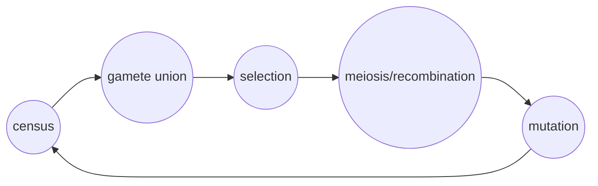

<link rel="stylesheet" href="https://unpkg.com/thebe@latest/lib/thebe.css">

# Lecture 19: The evolution of dominance

	Run notes interactively?
	

	

## Lecture overview

1. [Model](#section1)
2. [Resident equilibrium](#section2)
3. [Mutant invasion](#section3)
4. [Summary](#section4)

So far we've considered the invasion of a mutant whose dynamics is described by a single equation (e.g., $\mathrm{d}I_m/\mathrm{d}t$ in the previous lecture). We can extend this analysis to consider structured populations of mutants, e.g., age- or spatial-structure. The general approach is the same: find a stable resident equilibria and evaluate the Jacobian at that equilibrium to determine the mutant's invasion fitness. The only difference is that the submatrix describing the mutant's invasion is no longer 1x1, meaning the invasion fitness (eigenvalues) can be a little more complicated.

Below we will demonstrate the general method with a specific example: the evolution of dominance. The motivating observation is that many deleterious alleles are recessive, meaning the wild-type allele partially shields a heterozygote individual from selection. There are many examples in humans, such as sickle cell anemia and cystic fibrosis. In these examples the fitness of heterozygous individuals is indistinguishable from those without any deleterious mutations. Could the dominance of a wild-type allele over a deleterious allele be the result of adaptive evolution? To ask this question we perform an evolutionary invasion analysis on a population with genetic structure. This type of model is often referred to as a **modifier model** within the field of population genetics.

## 1. Model

The model is an extension of the 2-locus model we developed in lecture 13 to include mutation. We consider two loci each with two alleles. At one locus we have alleles $A_1$ and $A_2$. We'll treat $A_1$ as the wild-type allele and $A_2$ as the deleterious allele and refer to this $A$ locus as the selected locus. At the other locus we have alleles $B_1$ and $B_2$. We'll treat $B_1$ as the resident allele and $B_2$ as the mutant (modifier) and refer to this $B$ locus as the modifier locus. The analysis will determine when $B_2$ can invade. 

We consider diploid selection. Let the relative fitness of any individual with $A_1 A_1$ be 1 and the relative fitness of any individual with $A_2 A_2$ be $1-s$, with $0<s<1$. The relative fitnesses of the $A_1 A_2$ heterozygotes are affected by their genotype at the $B$ locus:

| diploid genotype | relative fitness | 
| :---: | :-------: | 
| $A_1A_2$ $B_1B_1$ | $1 - h_{11}s$ | 
| $A_1A_2$ $B_1B_2$ | $1 - h_{12}s$ | 
| $A_1A_2$ $B_2B_2$ | $1 - h_{22}s$ | 

We census the population in the haploid phase and keep track of the 4 haploid genotype frequencies:

| genotype | frequency |
| :------: | :-------: |
| $A_1B_1$ |   $x_1$   |
| $A_1B_2$ |   $x_2$   |
| $A_2B_1$ |   $x_3$   |
| $A_2B_2$ |   $x_4$   | 

with the constraint that the total frequency sums to one, $x_1+x_2+x_3+x_4 = 1$.

We treat time as discrete and assume the following life-cycle:

After selection but before mutation the frequencies are as they were in lecture 17,

$$\begin{align}
x_1' &= x_1(t) \sum_{i=1}^{4} x_i(t) w_{1i}/\bar{w} - r D^* \\
x_2' &= x_2(t) \sum_{i=1}^{4} x_i(t) w_{2i}/\bar{w} + r D^* \\
x_3' &= x_3(t) \sum_{i=1}^{4} x_i(t) w_{3i}/\bar{w} + r D^* \\
x_4' &= x_4(t) \sum_{i=1}^{4} x_i(t) w_{4i}/\bar{w} - r D^*,
\end{align}$$

where $w_{ij}=w_{ji}$ is the fitness of the diploid that is composed of haploid genotypes $i$ and $j$, $\bar{w}$ is the population mean fitness, and $D^*=x_1(t)x_4(t) w_{14}/\bar{w} - x_2(t)x_3(t) w_{23}/\bar{w}$ is linkage disequilibrium after selection.

We assume $A_1$ mutates to $A_2$ with probability $\mu$ and ignore back mutations (a relatively safe assumption given that the deleterious $A_2$ allele will be rare and therefore will create few mutants). The recursion equations are then

$$\begin{align}
x_1(t+1) &= (1-\mu)x_1'\\
x_2(t+1) &= (1-\mu)x_2'\\
x_3(t+1) &= x3' + \mu x_1'\\
x_4(t+1) &= x4' + \mu x_2'.
\end{align}$$

## 2. Resident equilibrium

We cannot find all equilibria of this system of nonlinear equations, but we can find some. Here we are most interested in the "resident" equilibrium where there are no $B_2$ alleles, $\hat{x}_2=\hat{x}_4=0$, which reduces us back to a one locus model. We'll also take $h_{11}=1/2$ for simplicity, meaning that the resident $B_1$ allele makes the $A$ locus additive. Then there is a relatively simple resident equilibrium, 

$$
\begin{align}
\hat{x}_1 = 1 - \frac{\mu}{(1+\mu)s/2} \\
\hat{x}_3 = \frac{\mu}{(1+\mu)s/2},
\end{align}
$$

which says that the deleterious $A_2$ allele is maintained at a balance between its removal by selection and its generation by mutation. This equilibrium is valid as long as $\mu<(1+\mu)s/2$, which means mutation is weak relative to selection.

## 3. Mutant invasion

To evaluate the stability of this equilibrium we use the Jacobian evaluated at the resident equilibrium. Because we have 4 equations this is a 4x4 matrix. But if we arrange the equations in the following order, $x_1(t+1), x_3(t+1), x_2(t+1), x_4(t+1)$, then the Jacobian at the resident equilibrium can be written as an upper triangular block matrix, 

$$
\mathbf{J}|_{x_1=\hat{x}_1,x_3=\hat{x}_3,x_3=x_4=0} = \begin{bmatrix} \mathbf{J}_\mathrm{res} & \mathbf{V} \\ \mathbf{0} & \mathbf{J}_\mathrm{mut}\end{bmatrix}.
$$

Here $\mathbf{J}_\mathrm{res}$ describes the stability of the resident equilibrium in the absence of any $B_2$ alleles and $\mathbf{J}_\mathrm{mut}$ describes the stability of the resident equilibrium in the face of rare $B_2$ alleles. One can show that the eigenvalues of $\mathbf{J}_\mathrm{res}$ are always less than 1 when the resident equilibrium is valid, guaranteeing stability. 

We want to know whether $B_2$ alleles can invade the resident equilibrium. This is determined by the leading eigenvalue of $\mathbf{J}_\mathrm{mut}$, which we call the invasion fitness. Unfortunately the eigenvalues are a little complicated, but we can make some progress with a little trick. The equation for the eigenvalues of $\mathbf{J}_\mathrm{mut}$ is 

$$
\lambda^2 - \mathrm{Tr}(\mathbf{J}_\mathrm{mut}) \lambda + \mathrm{Det}(\mathbf{J}_\mathrm{mut}) = 0.
$$

Now, given that $\lambda$ is the invasion fitness of a mutant with dominance coefficient $h_{12}$ in a resident population with dominance coefficient $h_{11}=1/2$, the selection gradient is $\frac{\partial\lambda}{\partial h_{12}}|_{h_{12}=1/2}$. The trick is that we can get the selection gradient directly from the equation above without solving for invasion fitness. To make the dependence on $h_{12}$ clear and simplify the notation, write $\lambda=\lambda(h_{12})$, $-\mathrm{Tr}(\mathbf{J}_\mathrm{mut})=a(h_{12})$, and $\mathrm{Det}(\mathbf{J}_\mathrm{mut})=b(h_{12})$. We can then differentiate the equation above with respect to $h_{12}$ and rearrange for the selection gradient,

$$
\begin{align}
\frac{\partial \lambda^2}{\partial h_{12}} + \frac{\partial a}{\partial h_{12}} \lambda(h_{12}) + a(h_{12}) \frac{\partial \lambda}{\partial h_{12}} + \frac{\partial b}{\partial h_{12}} &= 0 \\
2\lambda(h_{12})\frac{\partial \lambda}{\partial h_{12}} + \frac{\partial a}{\partial h_{12}} \lambda(h_{12}) + a(h_{12}) \frac{\partial \lambda}{\partial h_{12}} + \frac{\partial b}{\partial h_{12}} &= 0 \\
\frac{\partial \lambda}{\partial h_{12}}(2\lambda(h_{12}) + a(h_{12})) &= - \frac{\partial a}{\partial h_{12}} \lambda(h_{12}) - \frac{\partial b}{\partial h_{12}} \\
\frac{\partial \lambda}{\partial h_{12}} &= - \frac{\frac{\partial a}{\partial h_{12}} \lambda(h_{12}) + \frac{\partial b}{\partial h_{12}}}{2\lambda(h_{12}) + a(h_{12})}
\end{align}
$$

We then evaluate at $h_{12}=1/2$, which is where the mutant is equivalent to the resident, i.e., $\lambda(1/2)=1$,

$$
\begin{align}
\left.\frac{\partial \lambda}{\partial h_{12}}\right|_{h_{12}=1/2} &= - \left(\frac{\frac{\partial a}{\partial h_{12}}\lambda(h_{12}) + \frac{\partial b}{\partial h_{12}}}{2\lambda(h_{12})+a(h_{12})}\right)_{h_{12}=1/2} \\
 &= - \left(\frac{\left.\frac{\partial a}{\partial h_{12}}\right|_{h_{12}=1/2}\lambda(1/2) + \left.\frac{\partial b}{\partial h_{12}}\right|_{h_{12}=1/2}}{2\lambda(1/2)+a(1/2)}\right) \\
 &= - \left(\frac{\left.\frac{\partial a}{\partial h_{12}}\right|_{h_{12}=1/2} + \left.\frac{\partial b}{\partial h_{12}}\right|_{h_{12}=1/2}}{2+a(1/2)}\right) \\
 &= - \frac{2(4r + s(1-2r))(s(1+\mu)-2\mu)\mu}{s(s(1+\mu) - 2\mu + r(2-s)(1-\mu^2))}.
\end{align}
$$

Given biological validity, $\mu<(1+\mu)s/2$, this is always negative (recall that $r\leq 1/2$). Therefore there is always selection to reduce the dominance coefficient, $h$. This means that selection could be responsible for making deleterious mutations recessive! However, there is a massive caveat. While the selection gradient is negative it is also proportional to $\mu$, which is tiny. This means that selection for recessive deleterious mutations is exceptionaly weak and so is easily overwhelmed by other forces (eg, genetic drift, migration, etc). The biological reason for such weak selection is that selection only acts on the variation that is present, and deleterious mutations are very rare at mutation-selection balance, $\mu/((1+\mu)s/2)$.  

## 4. Summary

- We can perform evolutionary invasion analysis in structured populations, e.g., here the mutant (modifier) allele can be paired with the advantageous or deleterious allele, meaing we have multiple equations describing the mutant's invasion. In this case the invasion fitness is determined by the eigenvalues of the mutant portion of the Jacobian, $\mathbf{J}_\mathrm{mut}$

- We can find the selection gradient without first solving for the invasion fitness by differentiating the characteristic polynomial of $\mathbf{J}_\mathrm{mut}$

- Selection favours masking deleterious mutations, but this selection is extremely weak

Practice questions from the textbook: 12.11, 12.13, 12.15a-c, 12.17
