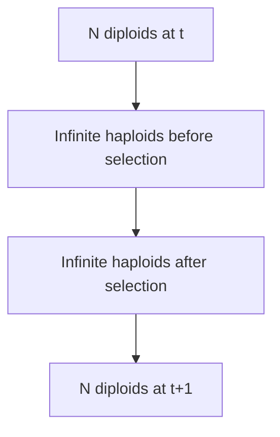

<link rel="stylesheet" href="https://unpkg.com/thebe@latest/lib/thebe.css">

# Lecture 19: Probability I (genetic drift)

	Run notes interactively?
	

	

## Lecture overview

1. [Discrete random variables](#section1)
2. [Expectation of a discrete random variable](#section2)
3. [Variance of a discrete random variable](#section3)
4. [Independence](#section4)
5. [Binomial random variable](#section5)
6. [Genetic drift](#section6)

!!! note "credits"

    This lecture was created by PhD student Puneeth Deraje as part of a course development TA position -- thanks Puneeth! If you are following along with the text, this lecture does not follow along as closely.

Until now we have been dealing with deterministic models, i.e., given the value of the variables at time $t$, we know exactly what the values will be at the next time. However, life is a little bit more random than that. Stochasticity (i.e., chance) is inherent in nature and can significantly alter the outcomes. In order to capture the effect of this stochasticity, we need some tools from **probability theory**.

## 1. Discrete random variables

### Example 1: a fair coin toss

Let's toss a toonie. If you get a heads, you use that toonie to buy a chocolate, otherwise you put the toonie in a piggy bank for grad school :P. Let $X$ denote the number of chocolates you have after the coin toss. Then $X$ can be equal to 0 or 1.  

In this case, tossing the coin is called an **event** and $X$ is the **random variable** that records its outcome. The **state space** is the set of all outcomes, {0,1}. We call $X$ a **discrete random variable** because there are a finite number of outcomes in the state space.

We don't know the exact value of $X$ until you actually toss the coin (i.e., until the event happens) -- we can not predict the outcome of the coin toss in that way. However, what we do know is that with a fair coin there is an equal chance of getting either a heads or tails. In other words, if we were to toss the coin a large number of times, say a million times, roughly half a million times we will see tails and the other half a million times we will see heads. 

Therefore, we say that $X$ takes the value 0 with **probability** $\frac{500000}{1000000}=0.5$ and 1 with probability $\frac{500000}{1000000}=0.5$. We can write this as 

$$\begin{aligned}
\Pr(X=0) &= 0.5\\
\Pr(X=1) &= 0.5 
\end{aligned}$$

Note that the sum of the probabilities of a random variable taking a value, over all values in the state space, is 1. Here, $\Pr(X=0) + \Pr(X=1) = 1$.

!!! note

    This way of thinking about the probability of a random variable $X$ taking a value $x$, as the fraction (frequency) of events where $X=x$, is *the frequentist interpretation of probability*. In order for the frequency to match the probability you need to repeat the event a large number of times (ideally infinitely). 

### Example 2: a biased coin toss

Consider the same situation as above but with a biased toonie, i.e., one that shows heads in not half but in a fraction $p$ of a very large number of events. Then

$$\begin{aligned}
\Pr(X=0) &= 1-p \\
\Pr(X=1) &= p \\
\end{aligned}$$

This random variable $X$ is called a **Bernoulli random variable** with parameter $p$ and is denoted as $X\sim\mathrm{Ber}(p)$. Above, with a fair coin, $X\sim\mathrm{Ber}(1/2)$.

### Example 3: a fair die roll

Now suppose you roll a fair 6-sided die to decide how many chocolates you will buy (this is nice because you never get 0!). Then, if $X$ denotes the number of chocolates, we have 

$$\begin{aligned}
\Pr(X=1) &= \frac{1}{6}\\
\Pr(X=2) &= \frac{1}{6} \\
\Pr(X=3) &= \frac{1}{6}  \\
\Pr(X=4) &= \frac{1}{6} \\
\Pr(X=5) &= \frac{1}{6}  \\
\Pr(X=6) &= \frac{1}{6}  
\end{aligned}$$

The state space here is {1,2,3,4,5,6} and $\sum_{x=1}^6 \Pr(X=x) = 1$.

## 2. Expectation of a discrete random variable

Given this way of thinking about stochasticity, one might be interested in questions like "What is the value of $X$, on average?" and "How certain can I be about the outcome of $X$?". 

In order to answer these questions we need to define two important properties of a random variable, its expectation and variance.

The **expectation** of a random variable is the average value of outcomes if the event is repeated infinitely many times. 

### Example 1: a fair coin toss

Suppose we toss the fair coin a million times. By the frequentist definition of probability we should see tails ($X=0$) half a million times and heads ($X=1$) the other half a million times. The expected value of $X$ is then

$$\begin{aligned}
\mathbb{E}(X) &= \frac{\overbrace{0+0+...+0}^{\text{0.5 million times}}+\overbrace{1+1+...+1}^{\text{0.5 million times}}}{\text{1 million}}\\
&= \frac{ 0 \times \text{0.5 million} + 1 \times \text{0.5 million} }{\text{1 million}}\\
&= 0 \times \frac{\text{0.5 million}}{\text{1 million}} + 1 \times \frac{\text{0.5 million}}{\text{1 million}}\\
&= 0 \times (1/2) + 1 \times (1/2) \\
&= 0.5
\end{aligned}$$
 
### Example 2 : a biased coin toss

Suppose we repeat the whole procedure for a biased coin, i.e., $X\sim\mathrm{Ber}(p)$. Then

$$\begin{aligned}
\mathbb{E}(X) &= \frac{\overbrace{0+0+...+0}^{(1-p) \text{ million times}}+\overbrace{1+1+...+1}^{p \text{ million times}}}{\text{1 million}} \\
&= 0 \times (1-p) + 1 \times p \\
&= p
\end{aligned}$$

### Example 3: a fair die roll

If we do the same for a fair 6-sided die,

$$\begin{aligned}
\mathbb{E}(X) 
&= \frac{\overbrace{1+1+...+1}^{(1/6) \text{ million times}} + \overbrace{2+2+...+2}^{(1/6) \text{ million times}} + \overbrace{3+3+...+3}^{(1/6) \text{ million times}} + \overbrace{4+4+...+4}^{(1/6) \text{ million times}} + \overbrace{5+5+...+5}^{(1/6) \text{ million times}} + \overbrace{6+6+...+6}^{(1/6) \text{ million times}}}{\text{1 million}} \\
&= 1\times\frac{1}{6} + 2\times\frac{1}{6} + 3\times\frac{1}{6} + 4\times\frac{1}{6} + 5\times\frac{1}{6} + 6\times\frac{1}{6}\\
&= 3.5
\end{aligned}$$

!!! note "Expectation"

    In general, the **expectation** of a discrete random variable is $\mathbb{E}(X) = \sum_x x \Pr(X=x)$, where the sum is over the entire state space.

### Properties of expectation

1. If $c$ is a constant then $\mathbb{E}(c)=c$ and $\mathbb{E}(cX)=c\mathbb{E}(X)$
2. If $X$ and $Y$ are two random variables then $\mathbb{E}(X+Y) = \mathbb{E}(X) + \mathbb{E}(Y)$
3. Suppose $X$ is a random variable and $f$ is any function then $\mathbb{E}(f(X)) = \sum_x f(x)P(X=x)$. For example, let $f(x) = x^2$ and $X\sim\mathrm{Ber}(p)$ (e.g., a biased coin toss), then $\mathbb{E}(f(X)) = \sum_{x=0}^{1}x^2P(X=x)= 0^2(1-p)+1^2p = p$.

## 3. Variance of a discrete random variable

Suppose we have an extremely biased coin with $p=1$. That is, the coin always shows heads. Can we, before tossing, say something about the outcome in this case? Yes, we know exactly what the outcome will be, heads. Similarly, if $p=0$ we would know the exact outcome, tails. We say there is no *uncertainity* in either of these cases.

Now, consider a slightly less biased coin with $p = 0.99$. Although we can not say exactly what the outcome will be, it will very likely be heads. There is some small amount of uncertainity.

Finally, suppose we toss a fair coin (i.e., $p = 0.5$). Then we have no idea at all what the outcome will be. There is very high uncertainity in this case.

!!! note "Variance"

    The **variance** of a random variable $X$, denoted $\mathrm{Var}(X)$, quantifies the uncertainity associated with the random variable and is given by

    $$\begin{aligned}
    \mathrm{Var}(X) 
    &= \mathbb{E}((X - \mathbb{E}(X))^2 )\\
    &= \mathbb{E}(X^2 - 2X\mathbb{E}(X) +  \mathbb{E}(X)^2)\\
    &= \mathbb{E}(X^2) - \mathbb{E}(2X\mathbb{E}(X)) +  \mathbb{E}(\mathbb{E}(X)^2)\\
    &= \mathbb{E}(X^2) - 2\mathbb{E}(X)\mathbb{E}(X) +  \mathbb{E}(X)^2\\
    &= \mathbb{E}(X^2) - \mathbb{E}(X)^2
    \end{aligned}$$

### Example: a biased coin toss

If $X\sim\mathrm{Ber}(p)$ then

$$\begin{aligned} 
\mathrm{Var}(X) 
&= \mathbb{E}(X^2) - \mathbb{E}(X)^2 \\
&= p - p^2 \\
&= p(1-p)
\end{aligned}$$

Below we plot the variance of $X$ as a function of $p$.

<pre data-executable="true" data-language="python">
import matplotlib.pyplot as plt
import numpy as np

p_vals = np.arange(0,1,0.01)
Var_values = [ p*(1-p) for p in p_vals ]
plt.plot(p_vals, Var_values)

plt.axvline(x=0.5,linestyle='dashed')

plt.xlabel('$p$ = probability of getting a heads')
plt.ylabel('Var($X$)')
plt.show()
</pre>

    

    

Note that for $p=0$ or $p=1$ we have Var($X$) = 0, i.e., there is no uncertainity. Further note that Var($X$) = $p(1-p)$ peaks at $p=0.5$, i.e., the highest uncertainity is associated with the toss of a fair coin.

### Properties of variance 

1. If $c$ is a constant then Var$(c)$ = 0 
2. If $a$ and $b$ are constants and $X$ is a random variable then Var$(aX + b)$ = $a^2$Var$(X)$

## 4. Independence

Let's now look at two random variables simultaneously.

Let's play the same game as before. Toss a coin, if it's heads use the coin to buy a chocolate. If it's tails put the coin in the piggy bank. As before, let $X$ be the number of chocolates after the toss, $X\sim$Ber($p$). This time we'll also keep track of how many coins we put in the piggy bank, $Y$.

Now if $X=0$ then $Y=1$ and if $X=1$ then $Y=0$. The value of $Y$ *depends* on $X$, and vice versa, so $X$ and $Y$ are *not* **independent random variables**.

On the other hand, suppose you have two coins. You toss each coin and decide whether to use it to buy a chocolate. Let $X_1$ be the outcome of tossing the first coin. Let $X_2$ be the outcome of tossing the second coin. Then $X_1$ *does not depend* on $X_2$, and vice-versa, so $X_1$ and $X_2$ are independent random variables. 

!!! note "Independence"

    Two random variables $X$ and $Y$ are said to be independent if for every $x$ and $y$
    
    $$\Pr(X=x \text{ and } Y=y) = \Pr(X=x)\Pr(Y=y)$$

### Properties of independent random variables

If $X$ and $Y$ are independent random variables then

1. $\mathbb{E}(XY)=\mathbb{E}(X)\mathbb{E}(Y)$
2. Var($X+Y$) = Var($X$) + Var($Y$)

## 5. Binomial random variable

Let $X_1$ and $X_2$ be the outcome of two independent tosses of the same coin. We want know how many chocolates we have after two tosses, $X = X_1 + X_2$. Recall that $X_1$ and $X_2$ are both Ber($p$). Therefore, 

$$\begin{aligned} 
\mathbb{E}(X) &= \mathbb{E}(X_1) + \mathbb{E}(X_2)\\
&= p + p \\
&= 2p
\end{aligned}$$

Since $X_1$ and $X_2$ are independent we also have

$$\begin{aligned} 
\mathrm{Var}(X) 
&= \mathrm{Var}(X_1) +\mathrm{Var}(X_2)\\
&= p(1-p) + p(1-p)\\
&= 2p(1-p)
\end{aligned}$$

Now let's look at three special cases to see what this means. 

If $p=0$ then $\mathbb{E}(X) = 0$ and $\mathrm{Var}(X)=0$. If the coin always shows tails then we know with certainity that we will have no chocolates after two tosses.

Similarly, if $p=1$ then $\mathbb{E}(X) = 2$ and $\mathrm{Var}(X)=0$. If the coin always shows heads then we know with certainity that we will have two chocolates after two tosses. 

Finally, if $p=0.5$ then $\mathbb{E}(X) = 1$ and $\mathrm{Var}(X)=1$. With a fair coin we expect to have 1 chocolate but there is some uncertainity since we could end up with 0, 1, or 2.

!!! note "Binomial random variable"

    In general we could have $n$ coins. Let $X_i$ denote the outcome of the $i^{\mathrm{th}}$ toss, which is Ber($p$) and independent of all other tosses. Then the sum over all $n$ Bernoulli random variables, $X = X_1 + X_2 + ... + X_n$, is called a **binomial random variable** with parameters $n$ and $p$, and is denoted by Bin($n,p$).

    The expectation of a binomial random variable is
    
    $$\mathbb{E}(X) = np$$
    
    and its variance is
    
    $$\mathrm{Var}(X) = np(1-p)$$
    
    Moreover, we can compute the probability of a binomial random variable $X\sim$Bin($n,p$) taking value $k$, as 
    
    $$P(X = k) = {n \choose k} p^k (1-p)^{n-k}$$
    
    where ${n \choose k}$ is read "$n$ choose $k$" and is the number of ways of choosing $k$ items from $n$ options. Mathematically, 
    
    $$\begin{aligned}
    {n \choose k} 
    &= \frac{n}{k} {n-1 \choose k-1}\\
    &= \frac{n}{k} \frac{n-1}{k-1} {n-2 \choose k-2}\\
    &= \vdots\\
    &= \frac{n (n-1) (n-2)\cdots (n-k+1)}{k(k-1)(k-2)\cdots 1} 
    \end{aligned}$$

## 6. Genetic drift

Recall our model of one-locus haploid selection from [Lecture 4](lecture-04.md). If $p_t$ is the frequency of allele $A$ in the population at time $t$ then we said that the frequency of $A$ in the next generation is

$$ 
p_{t+1} = \frac{p_t W_A }{p_t W_A + (1-p_t)W_a} 
$$

where $W_A$ is the fitness of $A$ and $W_a$ is the fitness of $a$.

One unspoken assumption here is that the population size is infinitely large (or at least sufficiently big). In reality, populations are not infinitely large and may even be quite small. This finiteness introduces stochasticity, which in evolution we call **genetic drift**. One well-known model that incorporates genetic drift is the **Wright-Fisher model**. This model assumes that there are $N$ diploid individuals in generation $t$, each of which produce an infinite number of haploid gametes, of which $2N$ are randomly sampled to form the diploid individuals of generation $t+1$. Here, with haploid selection, we assume the frequency of gametes changes due to selection before sampling for the next generation.

    
So, let $p_t$ be the frequency of allele $A$ in generation $t$. Each diploid individual contributes an infinite number of gametes, so the frequency of $A$ in the gamete pool is also $p_t$. Now selection acts on the gamete pool, altering the frequencies as in our original model, so that the frequency of $A$ in the gamete pool is now $p_t' = \frac{p_tW_A }{p_t W_A + (1-p_t)W_a}$. We then sample $2N$ gametes to form the next diploid generation. For each gamete we pick there is a probability $p'_t$ that it has allele $A$ and a probability $1-p'_t$ that it has allele $a$. Let $X$ be the number of $A$ alleles in a randomly chosen gamete. Then $X\sim$Ber$(p'_t)$ and the total number of $A$ alleles after $2N$ samples, $n_A(t+1)$, is the sum of $2N$ Bernoulli random variables, implying $n_A(t+1)\sim$Bin$(2N,p'_t)$. The frequency of allele $A$ in the next generation is then

$$\begin{aligned} 
p_{t+1} 
&= \frac{n_A(t+1)}{2N}\\ 
&= \frac{\text{Bin}(2N,p_t')}{2N}
\end{aligned}$$ 

With this model we can no longer predict exactly what the frequency of $A$ will be in the next generation. However, we can compute the expectation

$$\begin{aligned} 
\mathbb{E}(p_{t+1}) &= \mathbb{E}\left(\frac{\text{Bin}(2N,p_t')}{2N}\right)\\
&= \frac{1}{2N}\mathbb{E}\left(\text{Bin}(2N,p_t')\right)\\
&= \frac{2N p_t'}{2N}\\
&= p_t' 
\end{aligned}$$

and the variance

$$\begin{aligned} 
\text{Var}(p_{t+1}) 
&= \text{Var}\left(\frac{\text{Bin}(2N,p_t')}{2N}\right) \\
&= \frac{1}{4N^2}\text{Var}(\text{Bin}(2N,p_t')) \\
&= \frac{2Np_t'(1-p_t')}{4N^2}\\
&= \frac{p_t'(1-p_t')}{2N}
\end{aligned}$$

The expectation is as before -- the population size is irrelevant. The variance, however, is largest when the population size is small and the expected frequency is near 0.5 (just as we saw for a general binomial random variable above).  

Note that variance goes to 0 as $N$ goes to infinity. Therefore, in an infinitely large population, the frequency of $A$ in the next generation is $p_{t+1} = p_t'$ with no uncertainity. This recovers the one-locus haploid selection model from earlier in the course. 

In the next lab we'll learn how to simulate this stochastic model of evolution.
