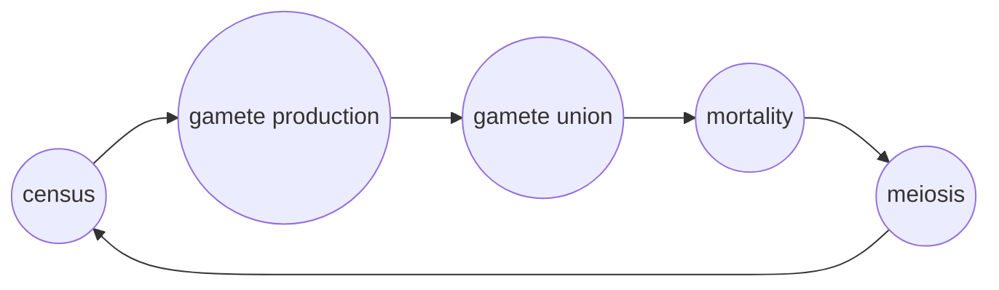

<link rel="stylesheet" href="https://unpkg.com/thebe@latest/lib/thebe.css">

# Lecture 20: The evolution of anisogamy

	Run notes interactively?
	

	

## Lecture overview

1. [Model](#section1)
2. [Singular strategy](#section2)
3. [Evolutionary branching](#section3)
4. [Specific example](#section4)
5. [Summary](#section5)

Let's look at one final example of evolutionary invasion analysis, focusing on the potential for evolutionary branching.

The biological question is why so many species are anisogamous -- that is, have gametes of two different sizes (e.g., a large egg and a small sperm) that come together to create zygotes. This dimorphism is hypothesized to arise from a trade-off between gamete number and gamete size (which increases survival). Here we build and analyze a model (following Doebeli 2011) that tests this logic. 

## 1. Model

Let's assume discrete non-overlapping generations. We census the population immediately after meiosis, in the haploid phase. Haploid individuals produce gametes, which randomly pair, and the diploid zygotes face some mortality (e.g., diploid selection) before meiosis and re-censusing.

Haploid individuals that produce gametes of size $x$ produce $1/x$ gametes. When gametes of size $x$ and $y$ fuse the zygote survives with probability $S(x+y)$ (which we will keep general for now) and at meiosis produces one haploid that produces gametes of size $x$ and one haploid that produces gametes of size $y$. 

Considering a population composed entirely of individuals producing size $x$ gametes, each individual produces $1/x$ gametes and the resulting zygotes survive with probability $S(x+x)=S(2x)$. This gives a reproductive factor of $R(x)=S(2x)/x$.

Now consider a rare mutant producing gametes of size $y$. They produce $1/y$ gametes, which always pair with a resident gamete and survive with probability $S(x+y)$. The mutant's reproductive factor is then $R_m(y,x)=S(x+y)/y$.

The dynamics of these two types can then be written

$$n(t+1)=R(x)n(t)$$

$$n_m(t+1)=R_m(y,x)n_m(t).$$

In this exponential growth model the mutant will invade whenever $R_m>1$, but we are instead interested in when the mutant increases in frequency. The recursion for the frequency of the mutant is

$$\begin{aligned}
p(t+1) &= \frac{n_m(t+1)}{n(t+1)+n_m(t+1)}\\
&\approx \frac{n_m(t+1)}{n(t+1)}\\
&=\frac{R_m(y,x)n_m(t)}{R(x)n(t)}\\
&=\frac{R_m(y,x)}{R(x)}p(t),
\end{aligned}$$

where we assume the mutant is rare, $n_m<<n$, in the second step.

Our analysis is now based on this one dimensional system. The resident equilibrium is $\hat{p}=0$. The 1x1 Jacobian is our invasion fitness,

$$\begin{aligned}
\lambda(y,x) &= \left.\frac{\mathrm{d}p(t+1)}{\mathrm{d}p(t)}\right|_{p(t)=\hat{p}=0}\\
&=\frac{R_m(y,x)}{R(x)}\\
&=\frac{xS(x+y)}{yS(2x)}.
\end{aligned}$$

## 2. Singular strategy

To determine how evolution will proceed we derive the selection gradient,

$$\begin{aligned}
D(x) &= \left.\frac{\partial \lambda}{\partial y}\right|_{y=x}\\
&= \frac{\partial}{\partial y}\left(\frac{xS(x+y)}{yS(2x)}\right)_{y=x}\\
&= \frac{x}{S(2x)}\frac{\partial}{\partial y}\left(\frac{S(x+y)}{y}\right)_{y=x}\\
&= \frac{x}{S(2x)}\left(\frac{S'(x+y)y - S(x+y)}{y^2}\right)_{y=x}\\
&= \frac{x}{S(2x)}\left(\frac{S'(2x)x - S(2x)}{x^2}\right)\\
&= \frac{S'(2x)}{S(2x)} - \frac{1}{x},
\end{aligned}$$

where $S'(2x)$ is the derivative of $S$ evalutated at $2x$. The first term is the survival advantage of producing bigger zygotes, and the second term is the cost of producing fewer gametes. 

We find the singular strategy by asking where there is no selection,

$$\begin{aligned}
D(\hat{x}) &= 0\\
\frac{S'(2\hat{x})}{S(2\hat{x})} - \frac{1}{\hat{x}} &= 0\\
\frac{S'(2\hat{x})}{S(2\hat{x})} &= \frac{1}{\hat{x}}\\
\hat{x} = \frac{S(2\hat{x})}{S'(2\hat{x})}.
\end{aligned}$$

Without specifying $S$ we do not have an explicit solution for $\hat{x}$. But this equality will be useful nonetheless. Given that survival is positive, we already see that $S$ must be an increasing function at $2\hat{x}$ for the singular strategy to be biologically valid.

## 3. Evolutionary branching

We are specifically interested in the possibility of $\hat x$ being an evolutionary branching point, leading to anisogamy. For this we first need $\hat x$ to be convergence stable,

$$\begin{aligned}
\left.\frac{\mathrm{d}D(x)}{\mathrm{d}x}\right|_{x=\hat{x}} &< 0\\
\frac{\mathrm{d}}{\mathrm{d}x}\left(\frac{S'(2x)}{S(2x)} - \frac{1}{x}\right)_{x=\hat{x}} &< 0\\
\left(\frac{2S''(2x)S(2x)-2(S'(2x))^2}{S(2x)^2} + \frac{1}{x^2}\right)_{x=\hat{x}} &< 0\\
\left(\frac{2S''(2x)}{S(2x)}-2\left(\frac{S'(2x)}{S(2x)}\right)^2 + \frac{1}{x^2}\right)_{x=\hat{x}} &< 0\\
\frac{2S''(2\hat{x})}{S(2\hat{x})}-2\left(\frac{S'(2\hat{x})}{S(2\hat{x})}\right)^2 + \frac{1}{\hat{x}^2} &< 0\\
\frac{2S''(2\hat{x})}{S(2\hat{x})}-2\left(\frac{1}{\hat{x}}\right)^2 + \frac{1}{x^2} &< 0\\
\frac{2S''(2\hat{x})}{S(2\hat{x})}-\frac{1}{\hat{x}^2} &< 0,
\end{aligned}$$

where we used the singular strategy condition, $\hat{x} = S(2\hat{x})/S'(2\hat{x})$, in the second last step.

For branching we also need $\hat{x}$ to be evolutionarily unstable (i.e., a fitness minimum),

$$\begin{aligned}
\left.\frac{\partial^2 \lambda}{\partial y^2}\right|_{y=x=\hat{x}} &> 0\\
\frac{\partial}{\partial y}\left.\frac{\partial \lambda}{\partial y}\right|_{y=x=\hat{x}} &> 0\\
\frac{\hat{x}}{S(2\hat{x})}\frac{\partial}{\partial y}\left(\frac{S'(x+y)y - S(x+y)}{y^2}\right)_{y=x=\hat{x}} &> 0\\
\frac{\hat{x}}{S(2\hat{x})}\left(\frac{S''(x+y)y^3 - (S'(x+y)y - S(x+y))2y}{y^4}\right)_{y=x=\hat{x}} &> 0\\
\frac{\hat{x}}{S(2\hat{x})}\frac{S''(2\hat{x})\hat{x}^3 - (S'(2\hat{x})\hat{x} - S(2\hat{x}))2\hat{x}}{\hat{x}^4} &> 0\\
\frac{\hat{x}}{S(2\hat{x})}\frac{S''(2\hat{x})\hat{x}^3}{\hat{x}^4} &> 0\\
\frac{S''(2\hat{x})}{S(2\hat{x})} &> 0\\
S''(2\hat{x}) &> 0\\
\end{aligned}$$

where we again use the singular strategy condition, $\hat{x} = S(2\hat{x})/S'(2\hat{x})$, in the third last step, and the fact that survival is non-negative in the final step. This result implies that survival must be decelerating with size at $2\hat{x}$.

## 4. Specific example

OK, now lets consider a specific functional form for survival. Let survival be a generic quadratic equation of size, $S(z)=a+bz+cz^2$.

We can then solve explicitly for our singular strategy,

$$\begin{aligned}
\hat{x} &= \frac{S(2\hat{x})}{S'(2\hat{x})}\\
\hat{x} &= \frac{a + 2b\hat{x} + 4c\hat{x}^2}{b + 4c\hat{x}}\\
b\hat{x} + 4c\hat{x}^2 &= a + 2b\hat{x} + 4c\hat{x}^2\\
0 &= a + b\hat{x}\\
\hat{x} &= -a/b.
\end{aligned}$$

For this to be biologically valid we need $\hat{x}>0$ (since it is a size), implying that $a$ and $b$ must be of opposite signs.

Convergence stability requires

$$\begin{aligned}
\frac{2S''(2\hat{x})}{S(2\hat{x})}-\frac{1}{\hat{x}^2} &< 0\\
\frac{4c}{a + 2b\hat{x} + 4c\hat{x}^2}-\frac{1}{\hat{x}^2} &< 0\\
\frac{4c}{-a + 4ca^2/b^2}-\frac{b^2}{a^2} &< 0\\
\frac{4c}{-a + 4ca^2/b^2} &< \frac{b^2}{a^2}\\
\frac{4ca^2}{-ab^2 + 4ca^2} &< 1\\
ab^2 &< 0.
\end{aligned}$$

Together with the fact that $a$ and $b$ must be opposite signs this implies $a<0$ and $b>0$.

Finally, $\hat{x}$ is a branching point if

$$\begin{aligned}
S''(2\hat{x}) &> 0\\
2c &> 0\\
c &> 0.
\end{aligned}$$

So, all together, if $a<0$, $b>0$, and $c>0$, then $\hat{x}$ is an evolutionary branching point, suggesting that anisogamy may evolve. Simulations confirm this. We have therefore verified the hypothesis, that a trade-off between gamete number and size can lead to the evolution of anisogamy, and we have clarified what needs to be true about the trade-off for this to occur (e.g., the signs of $a$, $b$, and $c$ for a quadratic $S$).

Below is a plot of invasion fitness for three different resident strategies. The right plot shows a positive selection gradient at $x<\hat{x}$ and the left plot shows a negative selection gradient at $\hat{x}<x$ (this is hard to see). The middle plot shows that the convergence stable singular strategy $\hat{x}=1$ is a fitness minima, implying evolutionary branching.

<pre data-executable="true" data-language="python">
import matplotlib.pyplot as plt
import numpy as np

def S(z,a=-2,b=2,c=2):
    return a + b * z + c * z**2
def invfit(y,x):
    return x*S(x+y)/(y*S(2*x))

xs = [0.5,1,4]
ys = np.linspace(0.01,5,100)

fig, axs = plt.subplots(1,len(xs),figsize=(12,3))
for i,xi in enumerate(xs):
    ax = axs[i]
    ax.plot(ys, [invfit(y,xi) for y in ys])
    ax.plot(ys, [1 for _ in ys], c='k')
    ax.scatter([xi],[1],c='k')
    ax.set_ylim(1/2,2)
    ax.set_title(r'resident gamete size $x=%s$' %xi, fontsize=10)
    ax.set_xlabel(r'mutant gamete size $y$')

axs[0].set_ylabel(r'invasion fitness $\lambda(y,x)$')

plt.show()
</pre>

    

    

## 5. Summary

- from invasion fitness we first derive the selection gradient, then the singular strategy, and then convergence and evolutionary stability
- a singular strategy that is convergence stable but not evolutionarily stable is an evolutionary branching point
- we can do much of these analyses without specifying all aspects of the model (here $S$)
- we have verified and refined the hypothesis that a trade-off between gamete size and number can logically lead to the evolution of anisogamy
