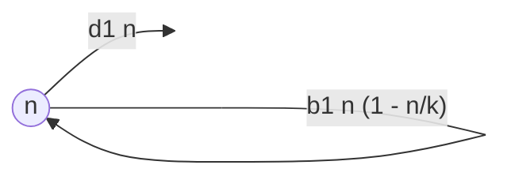
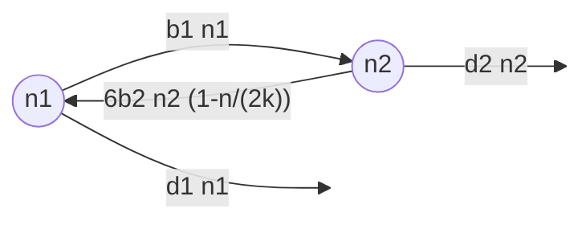

# Final project part II - example

	Run notes interactively?
	

	

  
!!! note

        This is a made-up example inspired by the research of Sydney Ackermann, an MSc student in the Osmond lab, who was in turn inspired by the models of [Roze & Michod](https://doi.org/10.1086/323590) and [Pichugin et al.](https://doi.org/10.1371/journal.pcbi.1005860).

## Biological question

!!! note

    In this case, this is just repeated from part I, so that part II tells the whole story from question to answer. Update and refine as needed.

I am interested in the origin of multicellularity and the reason why particular life-cycles predominate. For instance, many bacterial species exist as single cells which reproduce via binary fission while many multicellular organisms grow to large sizes and reproduce via single-celled offspring. However, there are many more options and it is not clear if or why these strategies are evolutionarily optimal or how multicellularity evolved from a binary fission ancestor. Here I ask the question, which multicellular life-cycles can invade a unicellular population producing via binary fission?

## Model

!!! note

    This is an improved, expanded version of the model description from part I, with more detail and now including the equations to be analyzed.

### Unicellular resident

Here I first model a unicellular population where individuals divide, die, and compete in continuous time. The variable in this model is the number of individuals, $n$. The parameters are the birth rate ($b_1$), death rate ($d_1$), and amount of competition. To describe competition I will assume there are a total of $k$ places for individuals to exist. When a cell divides, each of the two resulting offspring randomly choose one of these $k$ locations. If an offspring lands on an empty spot it survives. If an offspring lands on an occupied spot it "wins" that spot with probability 1/2, killing the resident, and otherwise dies. The amount of competition is therefore controlled by parameter $k$.

This model can be described by the following flow diagram

The corresponding differential equation is 

$$
\frac{\mathrm{d}n}{\mathrm{d}t} = b_1 n \left(1-\frac{n}{k}\right) - d_1 n
$$

which can be solved for equilibrium, $\hat{n}$.

### Multicellular invader

Next, imagine an invading multicellular population. 

#### 1+1+1

For instance, imagine a life-cycle where offspring are unicellular, they divide to form an individual with two cells, and then divide again to produce three single-celled offspring. We call this strategy 1+1+1 because those are the sizes of the offspring produced.

In this case we need to track the number of individuals with one, $n_1$, and two, $n_2$, cells (i.e., this is a structured population). I assume that each cell in an individual with $i$ cells divides at rate $b_i$ and that individuals with $i$ cells die at rate $d_i$. I also assume that this invading population is so rare (and $k$ so large) that offspring produced by this life-history strategy never land on other individuals with this same strategy. The offspring may, however, land on an individual from the unicellular population, which will reduce the growth rate of the invader.

The dynamics of this invading multicellular population can be described by the following flow diagram

To determine whether this population can invade a unicellular resident at equilibrium, I will calculate the leading eigenvalue from the system of (linear in $n_i$) differential equations

$$
\frac{\mathrm{d}\vec{n}}{\mathrm{d}t} = \mathbf{M}\vec{n}
$$

where $\vec{n}=\begin{pmatrix}n_1 \\ n_2\end{pmatrix}$ and 

$$
\mathbf{M}=
\begin{pmatrix} 
-b_1-d_1 & 6b_2(1-\hat{n}/(2k)) \\ 
b_1 & -2b_2-d_2 
\end{pmatrix}
$$

#### 1 + 2

The other multicellular strategy that has offspring sizes summing to 3 is 1+2. In this case the transition matrix is

$$
\mathbf{M}=
\begin{pmatrix} 
-b_1-d_1 & 2b_2(1-\hat{n}/(2k)) \\ 
b_1 & -2b_2-d_2+2b_2(1-\hat{n}/(2k)) 
\end{pmatrix}
$$

#### 1 + 1 + 1 + 1

We can also consider larger multicellular strategies, like 1+1+1+1. In this case we need to keep track of the number of groups of size 1, 2, and 3. This gives a 3x3 projection matrix

$$
\mathbf{M}=
\begin{pmatrix} 
-b_1-d_1 & 0 & 12b_3(1-\hat{n}/(2k)) \\ 
b_1 & -2b_2-d_2 & 0 \\
0 & 2b_2 & -3b_3-d_3
\end{pmatrix}
$$

#### 1 + 1 + 2

For the 1+1+2 strategy we have 

$$
\mathbf{M}=
\begin{pmatrix} 
-b_1-d_1 & 0 & 6b_3(1-\hat{n}/(2k)) \\ 
b_1 & -2b_2-d_2 & 3b_3(1-\hat{n}/(2k)) \\
0 & 2b_2 & -3b_3-d_3
\end{pmatrix}
$$

#### 1 + 3

For the 1+3 strategy we have 

$$
\mathbf{M}=
\begin{pmatrix} 
-b_1-d_1 & 0 & 3b_3(1-\hat{n}/(2k)) \\ 
b_1 & -2b_2-d_2 & 0 \\
0 & 2b_2 & -3b_3-d_3+3b_3(1-\hat{n}/(2k))
\end{pmatrix}
$$

#### 2 + 2

For the 2+2 strategy we have 

$$
\mathbf{M}=
\begin{pmatrix} 
-b_1-d_1 & 0 & 0 \\ 
b_1 & -2b_2-d_2 & 6b_3(1-\hat{n}/(2k)) \\
0 & 2b_2 & -3b_3-d_3
\end{pmatrix}
$$

## Results

### Unicellular resident

I first solve for the unicellular resident equilibrium

$$
\begin{aligned}
\frac{\mathrm{d}n}{\mathrm{d}t} &= b_1 n \left(1-\frac{n}{k}\right) - d_1 n \\
0 &= b_1 \hat{n} \left(1-\frac{\hat{n}}{k}\right) - d_1 \hat{n} \\
0 &= \hat{n} \left(b_1 \left(1-\frac{\hat{n}}{k}\right) - d_1\right) \\
\end{aligned}
$$

This implies that $\hat{n}=0$ or

$$
\begin{aligned}
0 &= b_1 \left(1-\frac{\hat{n}}{k}\right) - d_1 \\
d_1/b_1 &= 1-\frac{\hat{n}}{k} \\
1 - d_1/b_1 &= \frac{\hat{n}}{k} \\
k(1 - d_1/b_1) &= \hat{n} \\
\end{aligned}
$$

This non-zero equilibrium is biologically valid whenever $0\leq\hat{n}\implies d_1\leq b_1$. This non-zero equilibrium is stable when 

$$
\begin{aligned}
\frac{\mathrm{d}}{\mathrm{d}n}\left(\frac{\mathrm{d}n}{\mathrm{d}t}\right)_{n=\hat{n}} &< 0\\
b_1 \left(1-\frac{\hat{n}}{k}\right) - b_1 \hat{n}/k - d_1 &< 0\\
- b_1 (1-d_1/b_1) &< 0\\
- (b_1 - d_1) &< 0\\
b_1 &> d_1\\
\end{aligned}
$$

We will assume $b_1>d_1$ such that this non-zero equilibrium is both biologically valid and stable.

<pre data-executable="true" data-language="python">
# check our calculations

from sympy import *
var('b1,d1,b2,d2,b3,d3,k,n')

dndt = n*b1*(1-n/k) - d1*n #equation
eq = solve(dndt,n) #equilibrium
print(eq)

diff(dndt,n).subs(n,eq[1]).simplify() #stability condition
</pre>

### Multicellular invader

#### 1 + 1 + 1

Let's now look at the growth rate of a rare 1+1+1 strategy, by calculating the leading eigenvalue of $\mathbf{M}$. Because this is a 2x2 matrix we know that the eigenvalues solve

$$
\lambda^2 - \mathrm{Tr}(\mathbf{M})\lambda + |\mathbf{M}| = 0
$$

giving 

$$
\lambda = \frac{\mathrm{Tr}(\mathbf{M}) \pm \sqrt{\mathrm{Tr}(\mathbf{M})^2 - 4|\mathbf{M}|}}{2}
$$

For stability (ie, the multicellular strategy does not invade) we need $|\mathbf{M}|>0$ and $\mathrm{Tr}(\mathbf{M})<0$ (these are the Routh-Hurwitz conditions). The first requires

$$
\begin{aligned}
|\mathbf{M}| &> 0\\
(-b_1-d_1)(-2b_2-d_2) - 6b_2(1-\hat{n}/(2k))b_1 &> 0\\
(-b_1-d_1)(-2b_2-d_2) - 6b_2(1-(1 - d_1/b_1)/2)b_1 &> 0\\
(-b_1-d_1)(-2b_2-d_2) - 3b_2(1+d_1/b_1)b_1 &> 0\\
(-b_1-d_1)(-2b_2-d_2) - 3b_2(b_1+d_1) &> 0\\
(b_1+d_1)(d_2 - b_2) &> 0\\
\end{aligned}
$$

Since all $b_i$ and $d_i$ are non-negative (since they are rates) this implies stability when $d_2>b_2$.

The second condition requires 

$$
\begin{aligned}
\mathrm{Tr}(\mathbf{M}) &< 0 \\
(-b_1-d_1-2b_2-d_2) &< 0 \\
b_1+d_1+2b_2+d_2 &> 0 \\
\end{aligned}
$$

which is true as long as at least one of these rates is non-zero, which we already assumed to be the case for resident stability ($b_1>d_1$). 

To conclude, this 1+1+1 strategy will invade the unicellular strategy whenever $b_2> d_2$.

<pre data-executable="true" data-language="python">
# check our calculations

M = Matrix([
    [-b1 - d1, 6*b2*(1-n/(2*k))],
    [b1, -2*b2 - d2]])

det = M.det().subs(n,eq[1]).simplify()
tr =  M.trace().subs(n,eq[1]).simplify()
print(det)
print(tr)

(det - (b1+d1)*(d2-b2)).simplify() #check our simplified expression of the determinant
</pre>

#### 1 + 2

We can take the same approach for a rare 1+2 invader. In this case the determinant condition reduces to

$$
\begin{aligned}
|\mathbf{M}| &> 0\\
(-b_1-d_1)(-2b_2-d_2+2b_2(1-\hat{n}/(2k))) - 2b_2(1-\hat{n}/(2k))b_1 &> 0\\
(b_1 + d_1)(d_2 - b_2 d_1/b_1) &> 0\\
\end{aligned}
$$

and the trace determinant condition reduces to 

$$
\begin{aligned}
\mathrm{Tr}(\mathbf{M}) &< 0 \\
(-b_1-d_1-d_2+2b_2(1-\hat{n}/(2k))) &< 0 \\
-b_1-d_1-d_2-b_2(1-d_1/b_1) &< 0 \\
\end{aligned}
$$

The latter is always true, so the critical condition for invasion comes from the former, which can be rearranged as $b_2/b_1 > d_2/d_1$.

<pre data-executable="true" data-language="python">
# check our calculations

M = Matrix([
    [-b1 - d1, 2*b2*(1-n/(2*k))],
    [b1, -2*b2 - d2 + 2*b2*(1-n/(2*k))]])

det = M.det().subs(n,eq[1]).simplify()
tr =  M.trace().subs(n,eq[1]).simplify()
print(det)
print(tr)

(det - ((b1 + d1)*(d2 - b2*d1/b1))).simplify() #check our simplified expression of the determinant
</pre>

#### Larger multicellular strategies

In the remaining cases we are dealing with 3x3 matrices, and so the analytical expressions for the eigenvalues are not easy to interpret. Instead we plot the real part of the leading eigenvalue (ie, the invasion growth rate) as a function of the cell division rate in groups of size 2, $b_2$, for a specific set of paramter values (see figure caption). We also plot the invasion growth rates of two smaller multicellular strategies (analysed above) for comparison.  

<pre data-executable="true" data-language="python">
import matplotlib.pyplot as plt
import numpy as np

def plot_invasion_rate(M, nhat, pvals, b2s, ax, label=''):
    '''plot the invasion growth rate as a function of b2'''
    evs = M.eigenvals(multiple=True) #eigenvalues
    evseq = [ev.subs(n,nhat) for ev in evs] #eigenvalues at resident equilibrium
    evseqp = [ev.subs(pvals) for ev in evseq] #evaluate at chosen parameter vaues
    rs = [max([re(ev.subs(b2,i)).n() for ev in evseqp]) for i in b2s] #find the max of the real parts of each eigenvalue for each value of b2 
    ax.plot(b2s, rs, label=label) #plot
</pre>

<pre data-executable="true" data-language="python">
# projection matrices for each multicellular strategy

M111 = Matrix([
    [-b1 - d1, 6*b2*(1-n/(2*k))],
    [b1, -2*b2 - d2]])

M12 = Matrix([
    [-b1 - d1, 2*b2*(1-n/(2*k))],
    [b1, -2*b2 - d2 + 2*b2*(1-n/(2*k))]])

M1111 = Matrix([
    [-b1 - d1, 0, 12*b3*(1-n/(2*k))],
    [b1, -2*b2 - d2, 0],
    [0, 2*b2, -3*b3-d3]])

M112 = Matrix([
    [-b1 - d1, 0, 6*b3*(1-n/(2*k))],
    [b1, -2*b2 - d2, 3*b3*(1-n/(2*k))],
    [0, 2*b2, -3*b3-d3]])

M13 = Matrix([
    [-b1 - d1, 0, 3*b3*(1-n/(2*k))],
    [b1, -2*b2 - d2, 0],
    [0, 2*b2, -3*b3-d3+3*b3*(1-n/(2*k))]])

M22 = Matrix([
    [-b1 - d1, 0, 0],
    [b1, -2*b2 - d2, 6*b3*(1-n/(2*k))],
    [0, 2*b2, -3*b3-d3]])
</pre>

<pre data-executable="true" data-language="python">
# chose parameter values
pvals = {'b1':1.0,'d1':0.1,'d2':0.1,'d3':0.1,'k':100,'b3':1.0}
b2s = np.linspace(0,2,100) #range to plot over
nhat = eq[1]

#plot
fig, ax = plt.subplots()

plot_invasion_rate(M=M111, nhat=nhat, pvals=pvals, b2s=b2s, ax=ax, label='1+1+1')
plot_invasion_rate(M=M12, nhat=nhat, pvals=pvals, b2s=b2s, ax=ax, label='1+2')
plot_invasion_rate(M=M1111, nhat=nhat, pvals=pvals, b2s=b2s, ax=ax, label='1+1+1+1')
plot_invasion_rate(M=M112, nhat=nhat, pvals=pvals, b2s=b2s, ax=ax, label='1+1+2')
plot_invasion_rate(M=M13, nhat=nhat, pvals=pvals, b2s=b2s, ax=ax, label='1+3')
plot_invasion_rate(M=M22, nhat=nhat, pvals=pvals, b2s=b2s, ax=ax, label='2+2')

ax.plot(b2s, [0 for _ in b2s], c='k') #0 line for reference (invade if above this line)

plt.xlabel(r'$b_2$')
plt.ylabel('invasion growth rate')
plt.legend()
plt.show()
</pre>

Figure 1. The invasion growth rate (real part of leading eigenvalue) versus the rate of cell division in groups of size 2, $b_2$, for 6 multicellular strategies (see legend) invading a unicellular strategy, 1+1. Parameter values: $b_1=b_3=1$, $d_i=0.1$, and $k=100$.

## Discussion

### Answering the question

Above we have shown that any of the 6 chosen multicellular strategies can invade a unicellular strategy given certain conditions. For the smaller multicellular strategies (1+1+1 and 1+2) we were able to show these conditions analytically, in general. For the larger multicellular strategies (1+1+1+1, 1+1+2, 1+3, and 2+2), where the eigenvalues are more complicated, we turned to a numerical example. 

For 1+1+1, invasion requires cell division to be faster than death in groups of size 2, $b_2>d_2$. Essentially, the benefit a cell receives from being in a group ($b_2$) needs to outweigh the costs ($d_2$). It is interesting that this does not depend on the cell division and death rates in groups of size 1, $b_1$ and $d_1$. This is likely because all offspring of both the unicellular and multicellular strategy are size 1, so both strategies are affected equally by changes in $b_1$ and $d_1$.

For 1+2, invasion requires the cell division rate in groups of size 2 relative to that in groups of size 1 to be greater than the death rate in groups of size 2 relative to that in groups of size 1, $b_2/b_1>d_2/d_1$. This may be the case if groups of cells cooperate by sharing resources or protecting each other from the environment, which would increase $b_2/b_1$ or decrease $d_2/d_1$.

For larger multicellular strategies, our numerical example indicates that the invasion rate increases with the number of offspring.  Those strategies with 2 offspring (1+3 and 2+2) behave much like 1+2 while the strategy with 3 offspring behaves much like 1+1+1. It is the strategy with 4 offspring (1+1+1+1) that has the highest invasion growth rate and thus appears most like to invade a unicellular ancestor under this model. As shown in the figure below, this is despite the fact that the 1+1+1+1 strategy does not have the highest growth rate in the absence of competitors. Instead, it appears that having more (and hence smaller) offspring at the time of fragmenting makes a strategy more competitive, presumably because this increases the chances of winning a spot. 

<pre data-executable="true" data-language="python">
# chose parameter values
pvals = {'b1':1.0,'d1':0.1,'d2':0.1,'d3':0.1,'k':100,'b3':1.0}
b2s = np.linspace(0,2,100) #range to plot over
nhat = 0 #no unicellular individuals

#plot
fig, ax = plt.subplots()

plot_invasion_rate(M=M111, nhat=nhat, pvals=pvals, b2s=b2s, ax=ax, label='1+1+1')
plot_invasion_rate(M=M12, nhat=nhat, pvals=pvals, b2s=b2s, ax=ax, label='1+2')
plot_invasion_rate(M=M1111, nhat=nhat, pvals=pvals, b2s=b2s, ax=ax, label='1+1+1+1')
plot_invasion_rate(M=M112, nhat=nhat, pvals=pvals, b2s=b2s, ax=ax, label='1+1+2')
plot_invasion_rate(M=M13, nhat=nhat, pvals=pvals, b2s=b2s, ax=ax, label='1+3')
plot_invasion_rate(M=M22, nhat=nhat, pvals=pvals, b2s=b2s, ax=ax, label='2+2')

ax.plot(b2s, [0 for _ in b2s], c='k') #0 line for reference (invade if above this line)

plt.xlabel(r'$b_2$')
plt.ylabel('invasion growth rate')
plt.legend()
plt.show()
</pre>

Figure 2. The growth rate (real part of leading eigenvalue) versus the rate of cell division in groups of size 2, $b_2$, for 6 multicellular strategies (see legend) growing from rare in the absence of competition. Parameter values: $b_1=b_3=1$, $d_i=0.1$, and $k=100$.

### Limitations and extensions

There are a number of ways this analysis and model could be improved. For one, I have only looked at the invasion of a multicellular strategy into the unicellular resident. It therefore remains unclear if an invading multicellular strategy will completely displace the unicellular strategy or the both will coexist. Looking at the reverse situation, where the unicellular strategy invades a multicellular strategy would help answer this. Further, it is unclear how the multicellular strategies compete with each other. Exploring this would help us understand how and why complex multicellular organisms, like ourselves, have evolved. Another interesting direction is to allow competition to depend on the size of a group, for instance by making larger groups more likely to win spots resided by smaller groups. And finally, it would be interesting to include different cell types, like cooperators and cheaters, as multicellularity opens the door to within-group conflict, which may affect which strategies invade best.
