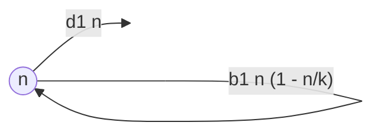
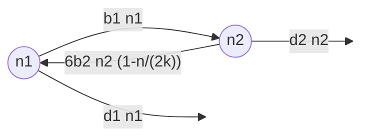

# Final project part I - example

!!! note

	This is a made-up example inspired by the research of Sydney Ackermann, an MSc student in the Osmond lab, who was in turn inspired by the models of [Roze & Michod](https://doi.org/10.1086/323590) and [Pichugin et al.](https://doi.org/10.1371/journal.pcbi.1005860).

## Biological question

I am interested in the origin of multicellularity and the reason why particular life-cycles predominate. For instance, many bacterial species exist as single cells which reproduce via binary fission while many multicellular organisms grow to large sizes and reproduce via single-celled offspring. However, there are many more options and it is not clear if or why these strategies are evolutionarily optimal or how multicellularity evolved from a binary fission ancestor. Here I ask the question, which multicellular life-cycles can invade a unicellular population producing via binary fission?

## Model description

I will start by modeling a unicellular population where individuals divide, die, and compete in continuous time. The variable in this model is the number of individuals, $n$. The parameters are the birth rate ($b_1$), death rate ($d_1$), and amount of competition. To describe competition I will assume there are a total of $k$ places for individuals to exist. When a cell divides, each of the two resulting offspring randomly choose one of these $k$ locations. If an offspring lands on an empty spot it survives. If an offspring lands on an occupied spot it "wins" that spot with probability 1/2, killing the resident, and otherwise dies. The amount of competition is therefore controlled by parameter $k$.

This model can be described by the following flow diagram

From the resulting differential equation I will determine the equilibrium number of unicellular individuals, $\hat{n}$.

Next I will model the dynamics of an invading multicellular population. For instance, imagine a life-cycle where offspring are unicellular, they divide to form an individual with two cells, and then divide again to produce three single-celled offspring. In this case we need to track the number of individuals with one, $n_1$, and two, $n_2$, cells (i.e., this is a structured population). I assume that each cell in an individual with $i$ cells divides at rate $b_i$ and that individuals with $i$ cells die at rate $d_i$. I also assume that this invading population is so rare (and $k$ so large) that offspring produced by this life-history strategy never land on other individuals with this same strategy. The offspring may, however, land on an individual from the unicellular population, which will reduce the growth rate of the invader.

The dynamics of this invading multicellular population can be described by the following flow diagram

The goal is then to see if the growth rate of this invading multicellular population is positive (i.e., it can invade) or negative (i.e., it cannot invade). This will require calculating the leading eigenvalue from the system of (linear) differential equations describing the rate of change in $n_i$.

## Equations

The equation for the unicellular population size is

$$\frac{\mathrm{d}n}{\mathrm{d}t} = b_1 n \left(1 - \frac{n}{k}\right) - d_1 n$$

and the equations for the invading multicellular population described above are

$$\begin{aligned}
\frac{\mathrm{d}n_1}{\mathrm{d}t} &= -(b_1 + d_1) n_1 + 6 b_2 n_2 \left(1 - \frac{n}{2k}\right)\\
\frac{\mathrm{d}n_2}{\mathrm{d}t} &= b_1 n_1 - (2b_2 + d_2) n_2
\end{aligned}$$

## Hypothesis

I hypothesize that, provided the $b_2$, $b_3$, ... are large enough relative to $b_1$ (ie, that cells divide fast enough in multicellular organisms) and the $d_2$, $d_3$, ... are small enough relative to $d_1$ (ie, that multicellular individuals don't die too quickly), there will be multicellular life-cycles that can invade a unicellular population. 
